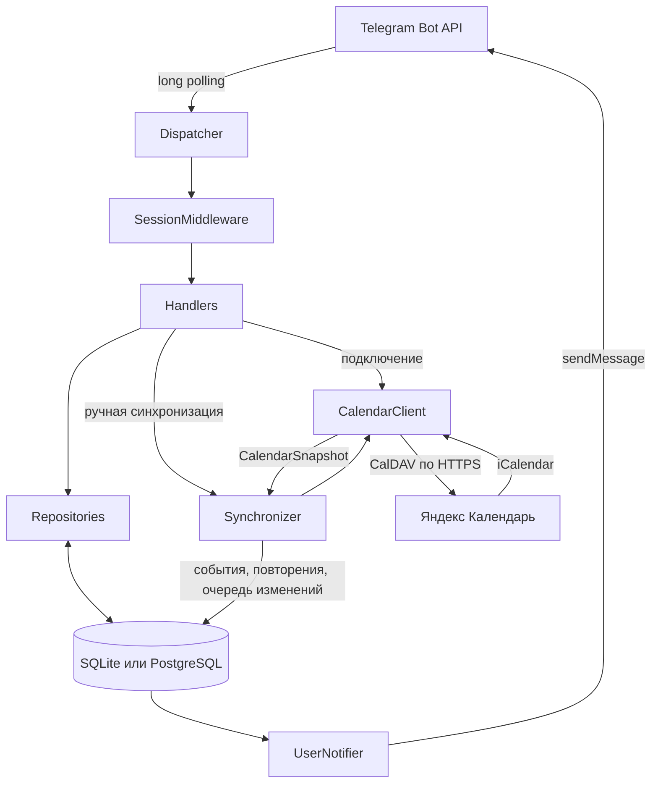
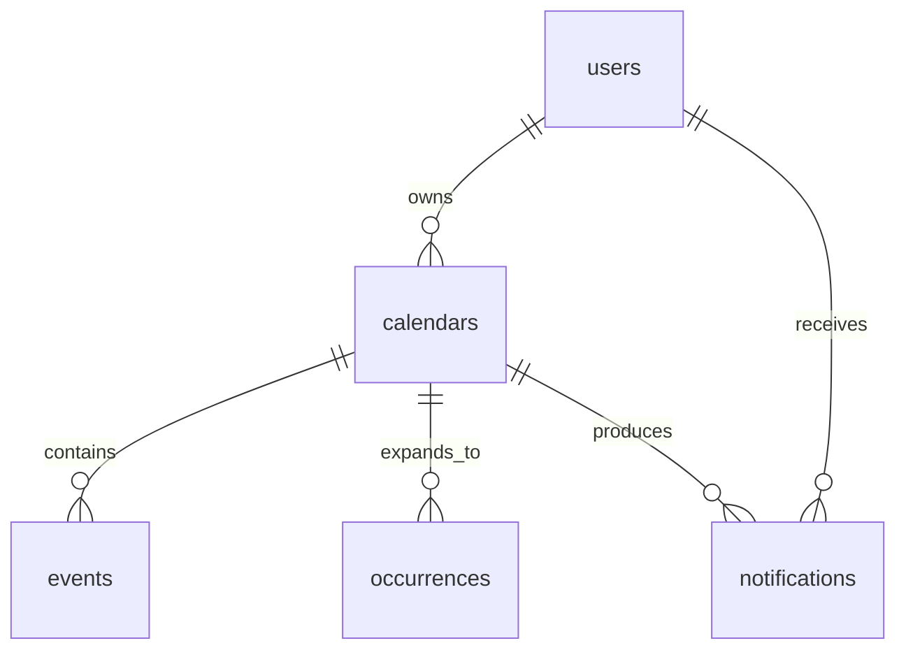
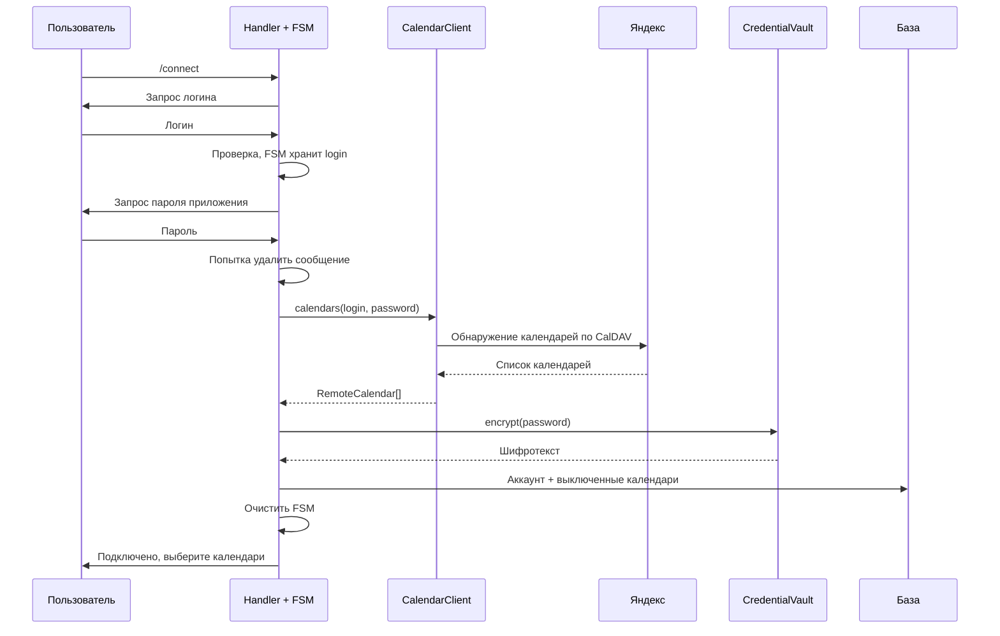

# Подробное устройство Telegram-бота для Яндекс Календаря

Документ описывает текущий код проекта на 19 сентября 2026 года. Здесь разобраны все собственные файлы проекта, данные и последовательность выполнения основных процессов. Содержимое пользовательской базы и секреты из `.env` в примерах не используются.

## Содержание

1. [Что делает бот и из каких частей состоит](#overview)
2. [Термины, которые используются в коде](#terms)
3. [Файлы корня, конфигурация и запуск](#startup-files)
4. [Диспетчер, middleware и маршрутизация](#dispatch)
5. [Все обработчики пользовательских действий](#handlers)
6. [Клавиатуры, состояния, проверки и форматирование](#helpers)
7. [Репозитории — запросы к базе](#repositories)
8. [Модели базы: каждое поле и связи](#database-models)
9. [CalendarClient: получение и разбор календаря](#calendar-client)
10. [Повторяющиеся встречи, RRULE и исключения](#recurrence)
11. [Синхронизатор: сравнение снимков и обнаружение изменений](#synchronizer)
12. [Напоминания, очередь, отправка и повторы попыток](#notifier)
13. [Шифрование паролей](#security)
14. [Подключение базы, миграции и перенос в PostgreSQL](#migrations)
15. [Файлы тестов и проверяемые сценарии](#tests)
16. [Полный путь каждого процесса](#flows)
17. [Ошибки, перезапуск, ограничения и диагностика](#limitations)
18. [Файлы `__init__.py` и служебные артефакты](#package-files)
19. [Где менять поведение бота](#change-map)

<a id="overview"></a>
## 1. Что делает бот и из каких частей состоит

Бот читает Яндекс Календарь, сохраняет локальное состояние встреч, замечает изменения и отправляет уведомления в Telegram. Пользователь выбирает календари, виды сообщений, часовой пояс и время напоминаний.

В текущей реализации направление работы такое:

```text
Яндекс Календарь → локальная база → уведомления Telegram
Пользователь Telegram → настройки и выбор календарей → локальная база
```

Создание, изменение и удаление встреч происходят в Яндексе. Команд для редактирования встреч в самом Яндексе из бота сейчас нет. «Событие создано» означает, что бот обнаружил новое событие при чтении календаря.

Приложение — один Python-процесс с тремя основными асинхронными направлениями работы:

| Часть | Что делает | Где реализована |
|---|---|---|
| Telegram polling | Получает команды, сообщения и нажатия кнопок | `bot/bot.py`, `bot/dispatcher.py`, `bot/handlers/` |
| Синхронизация | Опрашивает Яндекс и обновляет локальную копию | `bot/services/synchronizer.py`, `CalendarClient/` |
| Уведомления | Находит наступившие напоминания и отправляет очередь | `bot/services/user_notifier.py` |

Это не три отдельных сервера. Они выполняются через `asyncio` в одном приложении. Синхронные операции CalDAV вынесены в рабочие потоки через `asyncio.to_thread()`.



Два разных опроса важно различать:

- **Telegram long polling**: aiogram получает обновления через Telegram API. Это транспорт входящих сообщений пользователя.
- **Опрос Яндекса**: собственный цикл бота периодически выполняет CalDAV-запросы. Это источник календарных данных.

Открывать HTTP-порт для webhook этому приложению не требуется.

<a id="terms"></a>
## 2. Термины, которые используются в коде

| Термин | Что означает здесь |
|---|---|
| Handler / обработчик | Функция, которая обслуживает конкретную команду, кнопку или ввод в определённом состоянии |
| Router / маршрутизатор | Набор обработчиков и фильтров, определяющих, какому обработчику подходит обновление |
| Dispatcher | Главный объект aiogram, принимающий обновления и передающий их по маршрутизаторам |
| Middleware | Обёртка вокруг обработки обновления: здесь ограничивает работу личными чатами, открывает сессию базы и предоставляет пользователя |
| Callback query | Обновление Telegram после нажатия inline-кнопки; содержит строку `callback_data` |
| FSM | Состояние диалога: например, «сейчас ждём логин» или «сейчас ждём пароль» |
| ORM | SQLAlchemy связывает Python-объекты с таблицами и формирует SQL-запросы |
| Session | Рабочий контекст SQLAlchemy: выполняет запросы и отслеживает изменения загруженных объектов |
| Transaction | Набор изменений базы, который фиксируется совместно или откатывается при ошибке |
| `flush()` | Передаёт накопленные изменения в базу внутри текущей транзакции; можно получить выданный `id`, но это ещё не окончательная фиксация |
| `commit()` | Фиксирует текущую транзакцию |
| `rollback()` | Откатывает ещё не зафиксированную транзакцию |
| Snapshot / снимок | Результат одного успешного чтения календаря: список событий/серий и список конкретных повторений |
| Fingerprint | Хеш нормализованного содержания события: позволяет быстро проверить, изменились ли данные |
| Baseline / начальный снимок | Первое состояние после включения календаря, с которым будут сравниваться дальнейшие изменения |
| Outbox / очередь | Таблица `notifications`, где сообщение сначала сохраняется, а потом отправляется отдельным сервисом |
| Deduplication | Проверка, что одинаковое напоминание уже не было поставлено в очередь |
| Aware datetime | Дата и время с известным часовым поясом |
| Floating datetime | Время из календаря без указанного часового пояса; здесь трактуется в поясе пользователя |

`async def` объявляет асинхронную функцию. `await` позволяет дождаться операции, не занимая цикл событий непрерывным ожиданием. Это помогает одновременно ждать Telegram, базу и результаты CalDAV. Сам по себе `async def` не делает обычную блокирующую библиотеку асинхронной; поэтому для CalDAV отдельно нужен `to_thread()`.

<a id="startup-files"></a>
## 3. Файлы корня, конфигурация и запуск

### `pyproject.toml`

Описывает Python-проект, его зависимости и настройки инструментов.

- `build-system` выбирает `setuptools` как систему сборки.
- `project` задаёт имя `yandex-calendar-telegram-bot`, версию и Python `>=3.12`.
- `dependencies` перечисляет библиотеки, которые нужны запущенному боту.
- `optional-dependencies.postgres` добавляет `asyncpg` для PostgreSQL.
- `optional-dependencies.dev` добавляет pytest, pytest-asyncio и Ruff.
- `tool.setuptools.packages.find` включает пакеты `bot*`, `CalendarClient*`, `db*`.
- `tool.pytest.ini_options` направляет pytest в `tests/` и включает автоматическую обработку асинхронных тестов.
- `tool.ruff` задаёт Python 3.12, длину строки 100 и группы правил проверки кода.

Назначение основных зависимостей:

| Библиотека | Роль |
|---|---|
| `aiogram` | Telegram API, polling, маршрутизаторы, FSM и клавиатуры |
| `SQLAlchemy[asyncio]` | ORM, модели, запросы и асинхронные сессии |
| `aiosqlite` | Асинхронный драйвер SQLite |
| `asyncpg` | Драйвер PostgreSQL, устанавливается дополнительной группой |
| `alembic` | История и применение изменений схемы базы |
| `caldav` | Обращение к CalDAV-серверу Яндекса |
| `niquests` | Сетевой слой, классы ошибок которого использует обработка CalDAV-ошибок |
| `icalendar` | Разбор iCalendar, `VEVENT`, дат и свойств |
| `recurring-ical-events` | Получение отдельных повторений из правил и исключений |
| `cryptography` | Шифрование паролей Fernet |
| `pydantic-settings` | Чтение и проверка настроек запуска |
| `python-dotenv` | Чтение `.env`, в том числе в миграциях и переносе базы |
| `tzdata` | База часовых поясов, полезная в том числе на Windows |

Диапазоны версий ограничены в `pyproject.toml`, но отдельного lock-файла с точными версиями в проекте нет. Установка `pip install -e .` делает проект доступным из рабочей директории в режиме editable.

### `.env.example`

Шаблон настроек. Его копируют в `.env`, после чего заполняют значения для своего экземпляра бота. Сам шаблон не содержит действующих учётных данных.

| Переменная | Значение по умолчанию / смысл |
|---|---|
| `BOT_TOKEN` | Обязательный токен Telegram-бота |
| `ENCRYPTION_KEY` | Обязательный ключ Fernet для сохранённых паролей |
| `DATABASE_URL` | `sqlite+aiosqlite:///./calendar_bot.db` |
| `DEFAULT_TIMEZONE` | `Europe/Moscow`; применяется при создании нового пользователя |
| `SYNC_INTERVAL_SECONDS` | `60`; пауза после прохода синхронизации |
| `NOTIFIER_INTERVAL_SECONDS` | `5`; пауза после прохода уведомлений |
| `CALDAV_TIMEOUT_SECONDS` | `20`; таймаут, передаваемый CalDAV-клиенту |
| `REMINDER_GRACE_SECONDS` | `90`; допустимое окно опоздания напоминания |
| `EVENT_HORIZON_DAYS` | `45`; горизонт разворачивания повторений вперёд |
| `ADMIN_IDS` | `[]`; список Telegram ID администраторов в формате JSON |

`.env` — действующие настройки конкретной установки. Этот файл не является базой пользовательских настроек: выбранные календари, пользовательский часовой пояс и переключатели уведомлений хранятся в БД.

Относительный путь к SQLite и `.env` зависят от рабочей директории запуска. Команды проекта предполагают запуск из его корня.

### `.gitignore`

Определяет файлы, которые Git не должен предлагать к добавлению: `.env`, базы SQLite и их журналы, `data/`, виртуальное окружение, Python-кеши, кеши проверок, служебные файлы IDE и результаты сборки.

Это правило для Git, а не шифрование или ограничение доступа операционной системы. Оно также не удаляет файл из истории, если тот уже был закоммичен раньше.

### `README.md`

Краткая эксплуатационная инструкция: установка, запуск, подключение Яндекса, команды, ошибки подключения, настройки, PostgreSQL и проверки. Этот подробный документ дополняет README описанием внутренней работы.

### `bot/config.py`

Содержит `Settings`, наследующий `BaseSettings`, и функцию `get_settings()`.

`Settings` читает переменные окружения и `.env` в UTF-8. Неизвестные ключи `.env` игнорируются. Обязательные `bot_token` и `encryption_key` представлены типом `SecretStr`: он скрывает значение при обычном строковом представлении объекта. Чтобы использовать секрет, код явно вызывает `get_secret_value()`.

Проверки конфигурации:

1. `valid_key()` проверяет, что ключ можно передать Fernet.
2. `valid_timezone()` проверяет существование пояса через `ZoneInfo`.
3. `positive()` отклоняет нулевые и отрицательные интервалы, таймаут и горизонт событий.

`get_settings()` имеет `@lru_cache`: при обычной работе настройки создаются один раз и повторно возвращается тот же объект. Изменение `.env` само по себе не перенастраивает уже запущенный процесс; нужен перезапуск.

`SecretStr` не шифрует `.env`. Шифрование пользовательского пароля выполняет отдельный сервис `CredentialVault`.

### `bot/__main__.py`

Точка входа для команды:

```powershell
.\.venv\Scripts\python.exe -m bot
```

Python находит пакет `bot`, запускает `bot/__main__.py`, а тот импортирует и вызывает `main()` из `bot/bot.py`.

### `bot/bot.py`

Собирает приложение из отдельных частей и управляет его жизненным циклом.

`main()`:

1. Настраивает формат логов и уровень `INFO`.
2. Поднимает порог логирования для некоторых сетевых библиотек до `CRITICAL`, чтобы уменьшить риск попадания тел сетевых ответов и секретов в журнал.
3. Запускает `asyncio.run(run())`.
4. Для ошибки проверки настроек выводит имена полей и безопасные сообщения без исходных значений.
5. Обрабатывает `KeyboardInterrupt` как обычную остановку.
6. Для прочих ошибок запуска сообщает класс исключения без потенциально чувствительного текста.

`run()` выполняет действия в таком порядке:

1. Загружает `Settings`.
2. Применяет миграции до `head` через `asyncio.to_thread(migrate_database, ...)`.
3. Создаёт SQLAlchemy engine и фабрику сессий.
4. Создаёт хранилище шифрования `CredentialVault`.
5. Создаёт `CalendarClient` с заданным таймаутом.
6. Создаёт `Synchronizer`.
7. Создаёт aiogram `Bot` с HTML-форматированием и отключённым предпросмотром ссылок.
8. Создаёт диспетчер с middleware и маршрутизаторами.
9. Создаёт `UserNotifier`.
10. Удаляет webhook с `drop_pending_updates=False`: уже ожидающие Telegram-обновления намеренно не отбрасываются этим вызовом.
11. Регистрирует пользовательские команды в меню Telegram.
12. Запускает фоновые задачи `synchronizer.run()` и `notifier.run()`.
13. Переходит в `dispatcher.start_polling(...)`.

В polling передаются `settings`, `calendar_client`, `vault`, `synchronizer`. aiogram затем может передавать их обработчикам по именам аргументов. `allowed_updates` вычисляется по зарегистрированным обработчикам. `tasks_concurrency_limit=50` ограничивает число одновременно обрабатываемых входящих обновлений.

В блоке `finally` фоновые задачи отменяются и ожидается их завершение, закрывается FSM-хранилище, Telegram HTTP-сессия и engine базы. Закрытие Telegram-сессии выполняет этот код, поэтому в `start_polling` передано `close_bot_session=False`.

### `bot/generate_key.py`

Небольшая самостоятельная утилита:

```powershell
.\.venv\Scripts\python.exe -m bot.generate_key
```

Генерирует ключ `Fernet.generate_key()` и печатает его для сохранения в `ENCRYPTION_KEY`. Ей не нужен токен Telegram. Она не меняет уже сохранённые пароли и не переносит их на новый ключ. Для существующей базы нужен прежний ключ.

<a id="dispatch"></a>
## 4. Диспетчер, middleware и маршрутизация

### `bot/dispatcher.py`

`create_dispatcher(sessions, synchronizer, settings)` создаёт и возвращает настроенный `Dispatcher`.

- `MemoryStorage` хранит промежуточные состояния диалогов в оперативной памяти.
- `SimpleEventIsolation` упорядочивает обработку обновлений одного FSM-контекста, чтобы два сообщения не меняли состояние диалога одновременно.
- `SessionMiddleware` установлен как outer middleware для сообщений и callback query.
- Сначала подключается административный router, затем общий пользовательский router.

Вложенный `handle_error()` обслуживает необработанные ошибки Telegram-обработчиков. Он пишет в лог класс исключения и, если есть доступное сообщение, отвечает пользователю общим текстом с предложением повторить действие или выполнить `/cancel`. Ошибка самой отправки такого ответа подавляется. Возвращаемое `True` означает, что ошибка обработана этим обработчиком.

Фоновые циклы синхронизации и уведомлений имеют собственные `try/except`; они не проходят через этот Telegram error handler.

### `bot/middlewares/session.py`

`SessionMiddleware.__call__(handler, event, data)` выполняется вокруг выбранной обработки обновления.

Последовательность:

1. Из сообщения или callback получает `Message` и отправителя.
2. Если нужных объектов нет, не продолжает обработку.
3. Проверяет, что чат личный. В группе `/start` предлагает открыть личный чат; callback получает соответствующий ответ. Пользовательская запись для обычного группового обращения не создаётся.
4. Открывает сессию базы через фабрику `sessions()`.
5. Вызывает `get_or_create()` по Telegram ID отправителя.
6. Фиксирует создание пользователя через `commit()`.
7. Захватывает блокировку `synchronizer.locks[user.id]`.
8. Выполняет `session.refresh(user)`, чтобы обновить объект после возможного ожидания блокировки.
9. Кладёт `session` и `user` в словарь контекста `data`.
10. Вызывает обработчик.
11. При успехе делает `commit()`.
12. При исключении делает `rollback()` и передаёт исключение выше.
13. Освобождает блокировку и закрывает сессию.

Так обработчики получают текущего пользователя без повторяющегося кода во всех файлах. Параметр `user` здесь — ORM-объект `db.models.User`, а Telegram-отправитель доступен как `message.from_user` или `query.from_user`.

Блокировка координирует пользовательские обработчики и синхронизацию одного пользователя. Она живёт в памяти этого процесса. Сервис отправки уведомлений её не использует.

Некоторые обработчики сами вызывают `commit()` до завершения. Если после этого отправка ответа Telegram закончится ошибкой, последующий `rollback()` middleware не отменит уже зафиксированную настройку.

### `bot/handlers/user_router.py`

`build_router()` собирает маршрутизаторы в порядке:

```text
common → menu → events → settings → my_calendars → fallback
```

Порядок помогает общим командам вроде `/cancel` обрабатываться раньше ожидаемого текстового ввода FSM. В конце находится `unknown()`: если обычное сообщение не подошло ни одному предыдущему обработчику, бот предлагает меню, помощь или отмену.

### `bot/handlers/admin_router.py`

`build_router()` регистрирует `/stats`. Обработчик `stats()` проверяет `message.from_user.id` по `settings.admin_ids`.

Для разрешённого администратора два запроса `COUNT` возвращают число пользователей и календарей. Это общая статистика базы, включая выключенные календари и пользователей без подключённого Яндекса. Пароли и содержимое событий команда не показывает.

<a id="handlers"></a>
## 5. Все обработчики пользовательских действий

Общий принцип: обработчик разбирает намерение пользователя, вызывает репозиторий или сервис, сохраняет результат и отвечает в Telegram. Он не должен самостоятельно реализовывать разворачивание RRULE или алгоритм доставки очереди.

### `bot/handlers/common/user_routers.py`

Содержит текст `HELP` и `build_router()`.

- `start()` обслуживает `/start` и `/help`: очищает FSM, отправляет справку и главное меню.
- `cancel()` обслуживает `/cancel`: очищает незавершённый ввод и возвращает меню.

Создание записи пользователя уже произошло в middleware. `/start` не удаляет подключение к Яндексу и не сбрасывает настройки уведомлений. `/cancel` отменяет диалог, но не откатывает настройки, которые были сохранены ранее.

### `bot/handlers/menu/user_routers.py`

- `menu()` обрабатывает `/menu`, очищает FSM и отправляет главное меню.
- `menu_callback()` делает то же после кнопки с `callback_data="menu:home"`; дополнительно вызывает `query.answer()`, чтобы Telegram завершил индикатор ожидания на кнопке.
- `build_router()` регистрирует эти обработчики.

Главное меню обычно отправляется новым сообщением. Это не отдельная веб-страница и не постоянно открытая сессия с Яндексом.

### `bot/handlers/events/user_routers.py`

Отвечает за просмотр ближайших встреч.

`send_event_list(message, session, user)` в режиме «Список»:

1. Проверяет наличие сохранённых учётных данных.
2. Вызывает `repositories.events.upcoming(...)` с текущим временем, числом дней `user.upcoming_event_days` и часовым поясом пользователя.
3. Получает все будущие встречи за первые 1–7 непустых локальных дат из включённых календарей; по умолчанию выбрана одна дата, дни без встреч пропускаются.
4. Форматирует название, локальное время, название календаря и при наличии место и ссылку на встречу.
5. Если у календаря есть `last_error`, добавляет предупреждение, что данные могли устареть.
6. Разбивает длинный ответ на сообщения примерно до 3500 символов.

При `user.upcoming_catalog_mode=True` запрашивает первые `CATALOG_DAYS=7` непустых дат независимо от `user.upcoming_event_days` или все доступные, если их меньше семи. Использует исходное время открытия и фиксирует полный набор найденных дат, затем отправляет только первый день одним сообщением с `catalog_keyboard()`. Для этого режима отдельного сообщения-заголовка и разбиения дня на несколько сообщений нет; `catalog_text()` подбирает подробное или краткое представление.

`show_events(message, session, user)` вызывает `send_event_list()`, затем отправляет отдельное сообщение главного меню с учётом подключения аккаунта. Кнопки «← Меню» у сообщений списка нет. Главное меню также отправляется при пустом результате или отсутствии подключения.

`events_command()` обслуживает `/events`, `events_callback()` — `menu:events`. Оба очищают состояние ввода и вызывают общий `show_events()`.

**`catalog_page()`.** Обрабатывает `evcat:...`, проверяет курсор, владельца каталога, наличие подключения и совпадение часового пояса. После смены пояса просит открыть `/events` заново. Через `upcoming_on_day()` читает текущий кеш для конкретной даты курсора с исходной границей времени открытия, затем редактирует только сообщение каталога. Главное меню повторно не отправляется. Если все встречи выбранной даты исчезли или их календари выключены, показывает пустую выбранную дату; новые непустые даты не сдвигают страницы уже открытого каталога.

Здесь читается локальный кеш. Нажатие «Ближайшие события» само по себе не делает CalDAV-запрос. Запрос использует `starts_at >= now`, поэтому уже начавшаяся встреча в список не попадёт, даже если ещё не закончилась. До первой новой синхронизации после включения может быть виден сохранённый ранее кеш: запрос фильтрует `enabled`, но отдельно не проверяет `initialized`.

### `bot/handlers/my_calendars/user_routers.py`

Самый большой файл интерфейса: подключение аккаунта, список календарей, переключение, ручная синхронизация и отключение.

**`CONNECT_TEXT`.** Инструкция, какой логин и пароль приложения нужны. В ней есть ссылка на создание пароля приложения «Календарь» и объяснение, что пароль проходит через личный чат Telegram и сохраняется зашифрованным.

**`show_calendars()`.** Проверяет подключение и загружает календари пользователя. Для каждого показывает:

- название;
- включён или выключен;
- последнюю ошибку, если она есть;
- иначе время последней синхронизации в UTC;
- иначе ожидание синхронизации.

Разбивает список на части при превышении примерно 3500 символов или 30 календарей. Для каждой части создаёт клавиатуру с соответствующими календарями. Получение списка для этого экрана идёт из БД, а не напрямую из Яндекса.

**`connect_command()` и `connect_callback()`.** Вход через `/connect` или `menu:connect`. Очищают прежнее состояние. Если у пользователя сохранён `encrypted_password`, предлагают сначала отключить аккаунт через `/disconnect` и показывают меню без кнопки подключения. Эта проверка действует и для кнопок в старых сообщениях. Если аккаунт не подключён, устанавливают `ConnectAccount.login` и просят логин.

**`receive_login()`.** Срабатывает на сообщение в состоянии `ConnectAccount.login`:

1. Передаёт текст в `validate_login()`.
2. При ошибке сообщает причину и остаётся ждать логин.
3. При успехе сохраняет логин в FSM через `update_data(login=...)`.
4. Переключает состояние на `ConnectAccount.password`.
5. Просит пароль приложения. Логин в ответе экранируется для HTML.

**`receive_password()`.** Срабатывает в состоянии ожидания пароля:

1. Получает текст и удаляет пробелы по краям через `.strip()`.
2. Пытается удалить входящее сообщение Telegram. Если API не позволяет, просит удалить вручную.
3. Отклоняет пустое значение и строку длиннее 200 символов.
4. Берёт логин из FSM. Если он отсутствует, очищает состояние и предлагает `/connect`.
5. Завершает текущую транзакцию до сетевого обращения.
6. Сообщает о проверке подключения.
7. Вызывает `calendar_client.calendars(login, password)`.
8. При `authentication` оставляет состояние ожидания пароля: можно отправить другой пароль, а для смены логина — начать `/connect` заново.
9. При других безопасных CalDAV-ошибках очищает FSM и предлагает повторить подключение позже.
10. Только после успешной проверки удаляет старое локальное подключение через `disconnect()`.
11. Сохраняет логин и `vault.encrypt(password)` в пользователе.
12. Вызывает `reconcile()` для найденных календарей: новые строки выключены по умолчанию.
13. Делает `commit()`, очищает FSM и показывает список календарей.

Пароль не помещается в FSM. Он существует в локальной переменной во время проверки и шифруется перед сохранением. Для повторного подключения пользователь сначала подтверждает отключение текущего аккаунта. Новое подключение создаёт календари заново, поэтому их нужно снова выбрать; пользовательские переключатели уведомлений сохраняются.

**`calendars_command()` и `calendars_callback()`.** Открывают список через `/calendars` или `menu:calendars`; предварительно очищают FSM.

**`toggle_calendar()`.** Обрабатывает `calendar:toggle:<id>`:

1. Проверяет, что идентификатор состоит из десятичных цифр.
2. Запрашивает календарь одновременно по `id` и `user_id`.
3. Если календарь чужой или отсутствует, отвечает «Календарь недоступен».
4. Меняет `enabled` на противоположное значение.
5. Устанавливает `initialized=False`, `notifications_since=None`, `last_synced_at=None`.
6. Помечает ожидающие сообщения этого календаря как `discarded`.
7. Сохраняет изменения.
8. Сообщает результат и заново показывает список.

Эта кнопка не запускает чтение календаря немедленно. Оно произойдёт в следующем фоновом проходе или по `/sync`. Сброс `initialized` обеспечивает тихую первую синхронизацию и при первом, и при повторном включении.

**`sync()` и обёртки `sync_command()`, `sync_callback()`.** Общая функция ручного обновления вызывается через `/sync` или `calendar:sync`:

1. Очищает FSM и проверяет подключение.
2. Делает `commit()` сессии обработчика.
3. Отправляет сообщение «Синхронизирую календари…».
4. Вызывает `synchronizer.sync_user(user.id, already_locked=True)`.
5. Сбрасывает кеш ORM-объектов `session.expire_all()` и обновляет пользователя через `refresh()`.
6. Показывает актуальный список календарей и ошибки.

`already_locked=True` нужен потому, что middleware уже держит блокировку этого пользователя. Повторный захват обычного `asyncio.Lock` тем же процессом обработки привёл бы к ожиданию самого себя. Отдельные сессии синхронизатора меняют базу независимо от сессии обработчика, поэтому после них требуется обновить ORM-кеш.

Ручная синхронизация использует тот же алгоритм, что фоновая. Для уже инициализированного календаря она может создать уведомления об обнаруженных изменениях.

**`disconnect_prompt()` и `disconnect_callback()`.** `/disconnect` и `account:disconnect` показывают текст подтверждения удаления локальных данных. Само открытие подтверждения ничего не удаляет.

**`disconnect_confirm()`.** Обрабатывает `account:disconnect:confirm`, вызывает сервис удаления, фиксирует результат, очищает FSM и показывает главное меню. События в Яндексе сохраняются.

### `bot/handlers/settings/user_routers.py`

Работает с настройками уведомлений, которые находятся в `users`.

**`settings_text(user)`.** Строит заголовок экрана: общий статус, часовой пояс и пояснение независимости напоминания в начале и одного предварительного интервала.

**`discard_pending(session, user_id)`.** Помечает все ожидающие сообщения пользователя как `discarded`. Самостоятельно транзакцию не фиксирует.

**`settings_command()` и `settings_callback()`.** Открывают настройки по `/settings` или `menu:settings`, очищают FSM и отправляют текст с клавиатурой.

**`upcoming_events_text(user)`.** Объясняет режим просмотра и пропуск пустых дней. Для обычного списка показывает выбранное число дней от 1 до 7, по умолчанию 1; для каталога — фиксированные 7 дней со встречами и переключение дней в одном сообщении. Сохранённое число дней списка в режиме каталога не выводится как действующий диапазон. Часовой пояс показан в обоих режимах.

`settings:upcoming` открывает этот текст с отдельной клавиатурой. При выключенном каталоге `settings:upcoming:days:<value>` сохраняет `user.upcoming_event_days` для допустимых значений 1–7 и обновляет отметку выбора. Нажатия старых кнопок выбора дней при включённом каталоге игнорируются; клавиатура обновляется, скрывая эти кнопки. Настройка управляет обычным списком по кнопке «Ближайшие события» и `/events`; интервалы автоматических напоминаний она не меняет. Возврат `menu:settings` открывает настройки уведомлений.

**`upcoming_catalog()`.** Принимает `settings:upcoming:catalog:on` или `settings:upcoming:catalog:off`, сохраняет `user.upcoming_catalog_mode` и обновляет текст и клавиатуру. Повторное нажатие уже выбранного значения не меняет настройку. Сохранённое число дней обычного списка остаётся прежним и снова применяется после выключения каталога.

**`toggle()`.** Обрабатывает `settings:toggle:<key>`. Разрешённые ключи берутся из `NOTIFICATION_LABELS` плюс `notifications_enabled` и `remind_at_start`. Произвольное поле пользователя через callback изменить нельзя.

После переключения в `False` снимает ожидающие сообщения с отправки:

| Что выключено | Какие ожидающие сообщения отбрасываются |
|---|---|
| `notifications_enabled` | Все сообщения пользователя |
| `notify_created` | Только `created` |
| `notify_updated` | Только `updated` |
| `notify_deleted` | Только `deleted` |
| `notify_reminder` | Все `reminder` |
| `remind_at_start` | Только `reminder` с `offset_minutes=0` |

Затем фиксирует изменение, отвечает на callback и редактирует сообщение настроек. Общий выключатель уведомлений не выключает загрузку включённых календарей.

**`advance()`.** Обрабатывает `settings:advance:<value>`. Разрешены `1`, `3`, `5`, `10`, `off`. `off` преобразуется в `None`. Если значение уже выбрано, только сообщает об этом. При изменении сохраняет новый интервал и отбрасывает ожидающие предварительные напоминания с ненулевым интервалом. Напоминания в момент начала остаются независимыми.

**`timezone_prompt()`.** После `settings:timezone` переводит FSM в `EditSettings.timezone` и просит название IANA-пояса.

**`timezone_save()`.** Проверяет ввод через `validate_timezone()`, записывает `user.timezone`, отбрасывает все ожидающие сообщения пользователя и сбрасывает `last_synced_at` его календарей в `None`. После `commit()` завершает FSM.

Сброс времени синхронизации временно блокирует напоминания до нового чтения календаря. При этом `initialized` и `notifications_since` в этом обработчике не сбрасываются. События с явным часовым поясом сохраняют свой абсолютный момент; события без пояса и на весь день пересчитываются при следующей синхронизации.

<a id="helpers"></a>
## 6. Клавиатуры, состояния, проверки и форматирование

### `bot/keyboards/menu.py`

`menu_keyboard(connected=False)` создаёт две постоянные строки кнопок: «📅 Мои календари» и «🗓 Ближайшие события». Их `callback_data`: `menu:calendars` и `menu:events`. Если аккаунт не подключён, добавляет кнопку «🔗 Подключить Яндекс Аккаунт» с `menu:connect`. Обработчики передают `connected=bool(user.encrypted_password)`, поэтому у новых пользователей и после отключения кнопка видна, а у подключённых — скрыта.

`back_button()` возвращает кнопку главного меню с `menu:home`. Это общий элемент для других клавиатур.

### `bot/keyboards/my_calendars.py`

`calendars_keyboard(calendars)` создаёт:

1. По одной кнопке на календарь, с отметкой включения и укороченным названием.
2. Кнопку `calendar:sync`.
3. Кнопку «⚙️ Настройки уведомлений» с `menu:settings`.
4. Кнопку «🔌 Отключить Яндекс аккаунт» с `account:disconnect`.
5. Возврат в меню.

`disconnect_keyboard()` создаёт подтверждение `account:disconnect:confirm` и возврат. Проверка владения календарём находится в обработчике и репозитории, а не в подписи кнопки.

### `bot/keyboards/settings.py`

`settings_keyboard(user)` строит кнопки из текущих значений ORM-объекта пользователя:

- общий выключатель;
- четыре типа уведомлений;
- напоминание в момент начала;
- варианты 1, 3, 5, 10 минут;
- отключение предварительного напоминания;
- смена часового пояса;
- «🗓 Настройка ближайших событий» с `settings:upcoming`;
- кнопку «← Мои календари» с `menu:calendars`, возвращающую к списку календарей.

Вложенная функция `button()` оформляет одинаковые переключатели. Выбранный предварительный интервал отмечается отдельно. Клавиатура сама не сохраняет настройки: она лишь кодирует действие для следующего callback.

### `bot/keyboards/upcoming_events.py`

`upcoming_events_keyboard(user)` всегда начинает с кнопки «⬜ Режим каталога» или «✅ Режим каталога», отражающей `user.upcoming_catalog_mode` и передающей `settings:upcoming:catalog:on` или `settings:upcoming:catalog:off` соответственно. Только при выключенном каталоге ниже появляются кнопки выбора 1–7 дней обычного списка: текущее `user.upcoming_event_days` отмечено ✅, callback имеет вид `settings:upcoming:days:<value>`. Внизу находится «← Настройки уведомлений» с `menu:settings`. При включённом каталоге клавиатура содержит только переключатель и возврат; объяснение фиксированных 7 дней передаётся в тексте сообщения.

### `bot/keyboards/event_catalog.py`

`catalog_keyboard(cursor)` создаёт стрелки перехода по датам каталога. У первой страницы есть только →, у последней только ←, у промежуточных обе; если дата одна, возвращает `None`. Каждая стрелка содержит самостоятельный курсор для целевой страницы.

### `bot/states/states.py`

Два класса `StatesGroup`:

```text
ConnectAccount.login → ConnectAccount.password → завершение
EditSettings.timezone → завершение
```

`ConnectAccount` содержит состояния ввода логина и пароля. `EditSettings` содержит состояние ввода часового пояса. Состояния отвечают за интерпретацию следующего сообщения, а не за долговременное подключение к Яндексу.

Например, строка `Europe/Moscow` в `EditSettings.timezone` — новый часовой пояс. Такая же строка вне соответствующего состояния обычно попадёт в обработчик неизвестного сообщения.

### `bot/validators/settings.py`

- `validate_timezone(value)` обрезает пробелы и проверяет имя через `ZoneInfo`. При ошибке возвращает пользователю понятный `ValueError`.
- `validate_login(value)` обрезает пробелы по краям, проверяет непустое значение длиной до 320 символов и запрещает пробельные символы внутри и `:`. Это базовая проверка формата, а не доказательство существования аккаунта. Короткий логин также разрешён.
- `validate_advance(value)` возвращает `None` для `off`, иначе допустимое целое `1`, `3`, `5` или `10`; остальные значения отклоняет.

Проверка пароля приложения через Яндекс выполняется в `receive_password()`. Локальный валидатор не может установить, подходит ли пароль к аккаунту.

### `bot/utils/common.py`

`event_text(summary, starts_at, all_day, timezone)` формирует общий фрагмент текста встречи:

1. Ограничивает длину названия до 500 символов.
2. Экранирует его через `html.escape`, чтобы пользовательский текст не ломал HTML-разметку Telegram.
3. Переводит UTC-время в `ZoneInfo(timezone)`.
4. Для обычной встречи выводит дату, время и пояс.
5. Для события на весь день выводит дату и пометку «весь день».

Эта функция используется и в списке встреч, и в уведомлениях, поэтому представление времени согласовано.

### `bot/utils/event_catalog.py`

`CATALOG_DAYS=7` задаёт постоянное число ближайших непустых дат каталога; пользовательский диапазон обычного списка на него не влияет.

`CatalogCursor` хранит владельца, исходное UTC-время открытия, отпечаток часового пояса, полный фиксированный набор найденных дат (до семи) и индекс страницы. `callback(page)` упаковывает эти данные в компактную Base64-строку с префиксом `evcat:`, укладывающуюся в 64 байта Telegram. `decode()` проверяет формат, число и порядок дат и допустимость индекса. Состояние находится в кнопках каждого сообщения, поэтому каталоги независимы друг от друга и продолжают работать после перезапуска; FSM и отдельное хранилище страниц не требуются.

`catalog_text(rows, user, cursor)` показывает дату, номер дня, часовой пояс и карточки событий. Для большого дня переходит к кратким строкам времени и названия, постепенно сокращая названия, чтобы сообщение уложилось в 4000 единиц UTF-16. Если даже краткий список не помещается, явно сообщает число неотображённых событий и предлагает выключить каталог в настройках, выбрать 7 дней и снова открыть ближайшие события для полного списка. Пустая дата получает отдельное пояснение; ошибка синхронизации — предупреждение об устаревших данных.

### `bot/utils/settings_utils.py`

`NOTIFICATION_LABELS` связывает четыре поля `notify_*` с пользовательскими названиями типов уведомлений. Используется для клавиатуры и проверки допустимых переключателей.

`reminder_offsets(user)` вычисляет список действующих интервалов:

```text
remind_at_start=True,  advance_minutes=5    → [0, 5]
remind_at_start=False, advance_minutes=10   → [10]
remind_at_start=True,  advance_minutes=None → [0]
remind_at_start=False, advance_minutes=None → []
```

`0` означает время начала встречи. Выбрать одновременно 1 и 5 минут нельзя: в `advance_minutes` хранится одно значение. При этом начало и один предварительный интервал независимы.

<a id="repositories"></a>
## 7. Репозитории — запросы к базе

Репозитории знают таблицы и условия выборки. Они принимают сессию извне и обычно не делают `commit()`: границами транзакций управляет middleware, обработчик или сервис.

### `bot/repositories/user.py`

`get_or_create(session, telegram_id, timezone)`:

- ищет `User` по `telegram_id`;
- если найден — возвращает его;
- иначе добавляет пользователя с `telegram_id`, таким же `chat_id` для личного чата и заданным поясом;
- выполняет `flush()`, чтобы получить `id` и значения ORM по умолчанию;
- возвращает объект.

`connected_ids(session)` возвращает внутренние ID пользователей, у которых `encrypted_password IS NOT NULL`. Общее выключение уведомлений не исключает пользователя из синхронизации. Даже при всех выключенных календарях список календарей Яндекса продолжает обнаруживаться.

### `bot/repositories/my_calendar.py`

`user_calendars(session, user_id)` возвращает все локальные календари пользователя в порядке `id`.

`owned_calendar(session, user_id, calendar_id)` выбирает строку по обоим идентификаторам. Это защита от изменения чужого календаря через подставленный callback.

`reconcile(session, user_id, remote)` согласует список локальных календарей с полным обнаруженным списком Яндекса:

1. Индексирует локальные календари по `remote_key`.
2. Для нового удалённого календаря добавляет `MyCalendar`. ORM по умолчанию выставляет `enabled=False` и `initialized=False`.
3. У существующего обновляет название, сохраняя выбор пользователя.
4. Если локального календаря больше нет в удалённом списке, выключает его, снимает `initialized` и сохраняет текст о недоступности.
5. Выполняет `flush()`.

Пропавшие календари здесь физически не удаляются вместе с историей. Их события перестают участвовать в обычных выборках включённых календарей. Если такой календарь вновь появится по прежнему ключу, автоматически включённым он не станет.

### `bot/repositories/events.py`

`upcoming(session, user_id, now, *, days=1, timezone="Europe/Moscow")` соединяет `Occurrence` с `MyCalendar`, отбирает принадлежащие пользователю включённые календари и повторения с `starts_at >= now`. После перевода времени начала в указанный часовой пояс выбирает первые `days` непустых календарных дат. Дни без будущих встреч пропускаются; сегодняшняя дата учитывается, если в ней остались будущие встречи.

Возвращает все пары «повторение + календарь» за выбранные даты в порядке `starts_at`, без ограничения в 20 встреч или семь последовательных суток. Благодаря соединению обработчик сразу может показать название календаря рядом со встречей. Источником служит только локальный кеш повторений: его горизонт задаётся `EVENT_HORIZON_DAYS` и по умолчанию составляет 45 дней. Дополнительных запросов к Яндексу просмотр не делает; если в кеше меньше непустых дат, возвращаются доступные.

`upcoming_on_day(session, user_id, opened_at, day, timezone)` читает события конкретной локальной даты для страницы каталога. Переводит её границы в UTC и выбирает `max(opened_at, начало дня) <= starts_at < начало следующего дня` только из включённых календарей владельца. Исходное время открытия сохраняется при перелистывании. Данные событий перечитываются из кеша, а набор дат берётся из курсора: синхронизация не заменяет выбранную страницу другой непустой датой.

<a id="database-models"></a>
## 8. Модели базы: каждое поле и связи

### `db/models.py`: общая основа

`Base(DeclarativeBase)` — общий родитель ORM-моделей. Его `metadata` содержит описание таблиц и используется в миграциях и переносе данных.

`utcnow()` возвращает `datetime.now(UTC)`.

`UTCDateTime(TypeDecorator)` оборачивает `DateTime(timezone=True)`:

- перед записью требует время с часовым поясом и переводит его в UTC;
- при чтении из SQLite, который может вернуть время без `tzinfo`, прикрепляет UTC;
- при чтении aware-времени нормализует его в UTC;
- пропускает `None` для необязательных полей.

Так приложение сравнивает даты в одном представлении, хотя SQLite и PostgreSQL хранят их по-разному. `cache_ok=True` разрешает SQLAlchemy кешировать SQL для этого типа.

В проекте пять прикладных таблиц. Дополнительно Alembic ведёт `alembic_version`.



Связи обеспечены внешними ключами. ORM-атрибуты `relationship()` в этих моделях не объявлены: код использует явные запросы и соединения.

### `User` → `users`

Одна строка на Telegram-пользователя.

| Поле | Содержание |
|---|---|
| `id` | Внутренний целочисленный первичный ключ |
| `telegram_id` | Уникальный Telegram ID; тип `BigInteger` |
| `chat_id` | Адрес доставки Telegram-сообщений; в личном чате совпадает с ID пользователя |
| `timezone` | IANA-пояс, например `Europe/Moscow` |
| `yandex_login` | Логин Яндекса или `NULL`, если подключения нет |
| `encrypted_password` | Пароль приложения в виде шифротекста Fernet или `NULL` |
| `notifications_enabled` | Общий выключатель сообщений, по умолчанию `True` |
| `notify_reminder` | Разрешены ли напоминания, по умолчанию `True` |
| `notify_created` | Разрешены ли сообщения о создании, по умолчанию `True` |
| `notify_deleted` | Разрешены ли сообщения об удалении/отмене, по умолчанию `True` |
| `notify_updated` | Разрешены ли сообщения об изменении, по умолчанию `True` |
| `remind_at_start` | Напоминать ли в начале, по умолчанию `True` |
| `advance_minutes` | Один предварительный интервал `1/3/5/10`, либо `NULL`; по умолчанию `5` |
| `upcoming_event_days` | Число ближайших непустых дат обычного списка, от `1` до `7`; по умолчанию `1`; в режиме каталога не применяется |
| `upcoming_catalog_mode` | Просмотр по одному дню со стрелками вместо общего списка; по умолчанию `False` |
| `created_at` | Время регистрации в боте, UTC |

Ограничение `ck_users_advance_minutes` дополнительно проверяет допустимые ненулевые интервалы на уровне базы. `NULL` разрешён и означает выключенное предварительное напоминание.

`ck_users_upcoming_event_days` разрешает только значения от 1 до 7. Поле `upcoming_event_days` не допускает `NULL`; значение по умолчанию 1 задано и в ORM, и на уровне базы. Настройка сохраняется при отключении аккаунта вместе с остальными пользовательскими настройками.

`upcoming_catalog_mode` также не допускает `NULL` и имеет значение по умолчанию `False` в ORM и на уровне базы. Отключение аккаунта сохраняет выбранный режим.

### `MyCalendar` → `calendars`

Одна строка на календарь конкретного пользователя.

| Поле | Содержание |
|---|---|
| `id` | Внутренний ID календаря |
| `user_id` | Владелец, FK на `users.id` |
| `remote_key` | SHA-256 URL календаря; вместе с `user_id` уникален |
| `url` | CalDAV URL коллекции |
| `name` | Название календаря |
| `enabled` | Выбор пользователя, по умолчанию **`False`** |
| `initialized` | Успешно ли построен начальный снимок после последнего включения, по умолчанию `False` |
| `notifications_since` | Граница времени, раньше которой напоминания после включения не догоняются |
| `last_synced_at` | Время последнего успешно применённого снимка |
| `last_error` | Последняя безопасная ошибка чтения или `NULL` |

`enabled` и `initialized` отвечают на разные вопросы. Можно включить календарь, но ещё не успеть его загрузить: тогда `enabled=True`, `initialized=False`, и напоминания пока запрещены.

### `Event` → `events`

Одна строка на уникальный `UID` в календаре. Для повторяющейся встречи это состояние всей серии, включая её исключения в fingerprint.

| Поле | Содержание |
|---|---|
| `id` | Локальный ID строки |
| `calendar_id` | FK на календарь |
| `remote_key` | SHA-256 UID; уникален в пределах календаря |
| `uid` | Исходный UID iCalendar |
| `fingerprint` | Хеш нормализованной серии `VEVENT` |
| `change_state` | JSON с хешами отдельных компонентов и датами их актуальности; используется для подавления изменений прошлого |
| `revision` | Локальный счётчик обнаруженных изменений, начиная с `1` |
| `summary` | Название главного компонента серии |
| `starts_at` | Начало главного компонента в UTC |
| `all_day` | Начало задано датой без времени |
| `cancelled` | Главный компонент имеет `STATUS:CANCELLED` |

`revision` — внутренний счётчик бота. Он не является полем `SEQUENCE` Яндекса.

В этой таблице **нет `RRULE`, `RDATE`, `EXDATE`, полного ICS, описания или списка участников отдельными колонками**. Эти данные участвуют в разборе и/или вычислении fingerprint, но не сохраняются целиком.

### `Occurrence` → `occurrences`

Одна строка на конкретное вхождение встречи в расчётном окне. Используется для `/events` и напоминаний.

| Поле | Содержание |
|---|---|
| `id` | Локальный ID |
| `calendar_id` | FK на календарь |
| `remote_key` | Хеш UID и идентификатора повторения; уникален внутри календаря |
| `summary` | Название именно этого повторения |
| `location` | Место встречи; по умолчанию пустая строка |
| `starts_at` | Фактическое начало повторения, UTC; индексировано |
| `ends_at` | Окончание повторения, UTC |
| `all_day` | Событие на весь день |

Прямого `event_id` или `uid` в таблице `occurrences` нет. Логическая связь строится при разборе ICS, а в БД остаются календарь и непрозрачный ключ повторения. Из самого хеша исходный UID восстановить нельзя.

### `Notification` → `notifications`

Одна строка — одно подготовленное сообщение.

| Поле | Содержание |
|---|---|
| `id` | ID записи очереди |
| `user_id` | Получатель, FK на пользователя |
| `calendar_id` | Источник, FK на календарь |
| `dedupe_key` | Уникальный ключ записи; для напоминания детерминированный |
| `kind` | `reminder`, `created`, `updated`, `deleted` |
| `payload` | JSON, сериализованный в обычную текстовую колонку `Text` |
| `occurrence_key` | Ключ повторения для перепроверки напоминания; для сообщений об изменениях обычно `NULL` |
| `starts_at` | Начало встречи, для которой создано напоминание |
| `offset_minutes` | Интервал напоминания; `0` — начало |
| `status` | `pending`, `sent`, `discarded`; начальное значение `pending` |
| `attempts` | Счётчик обработанных ошибок временной доставки/лимита; начинается с `0` |
| `created_at` | Когда сообщение поставлено в очередь |
| `expires_at` | До какого времени сообщение имеет смысл отправлять |
| `next_attempt_at` | Когда разрешена следующая попытка |
| `sent_at` | Время, записанное при успешной отправке, иначе `NULL` |

Индекс `(status, next_attempt_at)` ускоряет поиск готовой очереди. `kind` и `status` — строковые поля с соглашениями в коде, а не SQL ENUM.

Содержимое очереди переживает обычный перезапуск. `attempts` не является числом всех вызовов Telegram: успешная отправка не увеличивает этот счётчик.

### Каскадное удаление и значения по умолчанию

Внешние ключи используют `ON DELETE CASCADE`. Удаление календаря удаляет его `events`, `occurrences` и `notifications`. Удаление пользователя на уровне БД также удалит зависимые данные, хотя `/disconnect` оставляет самого пользователя.

Значения `default=` заданы на стороне SQLAlchemy. Они подставляются при соответствующих вставках через SQLAlchemy, но не являются `server_default` в схеме. При вставке произвольным сырым SQL обязательные значения нужно учитывать самостоятельно.

<a id="calendar-client"></a>
## 9. CalendarClient: получение и разбор календаря

Этот пакет изолирует Яндекс и формат iCalendar от Telegram-интерфейса. Его результат — обычные Python-объекты, а не сообщения Telegram и не ORM-записи.

### `CalendarClient/models.py`

`stable_key(*values)` соединяет строки нулевым символом `\0`, вычисляет SHA-256 и возвращает шестнадцатеричную строку длиной 64 символа. Разделитель позволяет различать, например, пары `("ab", "c")` и `("a", "bc")`.

В разных местах входные данные отличаются:

| Назначение | Что хешируется |
|---|---|
| Календарь | Его URL |
| Событие/серия | UID |
| Конкретное повторение | UID и нормализованный RECURRENCE-ID, либо маркер `single` |
| Содержимое серии | Нормализованные компоненты VEVENT |
| Дедупликация напоминания | ID календаря, ключ повторения, фактическое начало, интервал |
| Запись сообщения об изменении | Новый случайный UUID |

Одинаковая функция хеширования не означает одинаковый смысл всех этих ключей.

Модели данных:

- `RemoteCalendar(url, name)` — найденный календарь. Свойство `key` вычисляет хеш URL.
- `RemoteEvent(key, uid, fingerprint, summary, starts_at, all_day, cancelled)` — краткое состояние события или серии.
- Его дополнительное поле `change_state` содержит служебные хеши и даты для проверки, затрагивает ли изменение ещё актуальные встречи.
- `RemoteOccurrence(key, summary, location, starts_at, ends_at, all_day)` — отдельное повторение.
- `CalendarSnapshot(events, occurrences)` — итог разбора одного календаря.

Это `dataclass(frozen=True)`: после создания нельзя обычным присваиванием заменить атрибут. Однако списки внутри `CalendarSnapshot` сами по себе остаются изменяемыми Python-списками. `default_factory=list` создаёт отдельный пустой список для каждого нового снимка.

### `CalendarClient/client.py`: подключение

`YANDEX_CALDAV_URL = "https://caldav.yandex.ru/"` задаёт сервер.

`CalendarClient.__init__(timeout=20)` сохраняет сетевой таймаут.

`_client(login, password)` создаёт `caldav.DAVClient` с URL сервера, именем пользователя, паролем, явным `auth_type="basic"` и таймаутом. Проверка TLS-сертификата не отключается. HTTPS защищает транспорт; Basic — способ передать авторизационные данные внутри этого соединения.

`calendars(login, password)` — асинхронная оболочка над синхронным `_calendars()`. Она выполняет его через `asyncio.to_thread()`.

`_calendars()`:

1. Открывает DAV-клиент в контекстном менеджере.
2. Получает `principal()` текущей учётной записи.
3. Запрашивает `principal().calendars()`.
4. Превращает элементы библиотеки в `RemoteCalendar`.
5. Для пустого имени использует «Календарь».
6. Закрывает клиент при выходе из `with`.
7. При исключении преобразует его в безопасный `CalendarConnectionError` с операцией `discover_calendars`.

`snapshot(...)` — асинхронная оболочка над `_snapshot(...)`, также использующая рабочий поток.

`_snapshot()`:

1. Разбирает URL календаря и требует схему `https` и hostname `caldav.yandex.ru`.
2. Открывает DAV-клиент с учётными данными пользователя.
3. Получает объект `client.calendar(url=url)`.
4. Вызывает `calendar.events()` для полного списка ресурсов событий.
5. Забирает исходные данные каждого элемента через `item.data`.
6. Закрывает сетевой клиент.
7. Передаёт строки в `parse_snapshot()`.

Код проверяет схему и hostname URL; отдельной строгой проверки порта в этой функции нет. Ошибки сетевого этапа классифицируются как `fetch_events`, ошибки разбора — как `parse_events`.

Запрос событий не ограничен ближайшими 45 днями. Полное чтение нужно для правильного сравнения: встреча, перенесённая за пределы окна напоминаний, должна выглядеть изменённой, а не удалённой. Ограничение горизонта применяется позже, только к разворачиванию повторений.

### `as_utc(value, timezone)`

Нормализует календарное начало или окончание:

| Вход | Обработка |
|---|---|
| `date` без времени | Полночь этой даты в поясе пользователя, затем UTC |
| `datetime` без `tzinfo` | Прикрепление пояса пользователя, затем UTC |
| `datetime` с `tzinfo` | Перевод известного абсолютного времени в UTC |

Например, `12:00 Europe/Moscow` соответствует `09:00 UTC`. У события на весь день `19 сентября` начало для Москвы — `18 сентября 21:00 UTC`, что при показе пользователю снова превращается в `19 сентября`.

### `semantic_fingerprint(components)`

Определяет, поменялось ли содержимое серии, которое учитывает бот.

Последовательность:

1. Делает `deepcopy()` каждого компонента, чтобы не менять объекты, которые затем используются для разворачивания повторений.
2. Удаляет `DTSTAMP`, `LAST-MODIFIED`, `CREATED`, `SEQUENCE`.
3. Для повторяющихся свойств, представленных списком, сортирует значения по паре `(item.to_ical(), item.params.to_ical())`.
4. Рекурсивно нормализует вложенные компоненты, например `VALARM`.
5. Сортирует вложенные компоненты.
6. Сериализует каждый VEVENT обратно в iCalendar.
7. Сортирует компоненты серии и хеширует результат.

Зачем нужны эти шаги:

- Сервер может изменить служебную временную метку без изменения встречи.
- Сервер может вернуть тот же список участников в другом порядке.
- Порядок VEVENT с исключениями не должен сам по себе менять состояние серии.
- Реальные параметры участника — адрес, имя `CN`, статус `PARTSTAT`, роль `ROLE` — должны продолжать учитываться.

Пример порядка участников:

```text
Первое чтение:       Второе чтение:
ATTENDEE:Alice       ATTENDEE:Bob
ATTENDEE:Bob         ATTENDEE:Alice

После нормализации → одинаковый fingerprint → уведомления нет.
```

Если у Alice вместо `PARTSTAT=ACCEPTED` стало `PARTSTAT=DECLINED`, fingerprint изменится.

Это конкретный алгоритм нормализации проекта, а не обещание полной семантической эквивалентности любых двух допустимых ICS-файлов. Изменения остальных сериализованных свойств VEVENT и вложенных компонентов могут влиять на хеш.

### Проверка времени изменения: `CalendarClient/changes.py` и дополнительные функции клиента

Полный fingerprint отвечает на вопрос «изменилось ли что-нибудь». Чтобы решить, нужно ли сообщать об этом пользователю, отдельно сохраняется `Event.change_state`:

- хеш главного компонента без списков `EXDATE`/`RDATE`;
- отдельные хеши исключений с `RECURRENCE-ID`;
- отдельные записи дат `EXDATE` и `RDATE`;
- время, до которого соответствующее изменение может затрагивать актуальные встречи;
- признак компонента, влияющего на серию, а не только одну дату.

`component_end()` вычисляет окончание VEVENT из `DTEND`, `DURATION` или длительности по умолчанию. `component_until()` задаёт исключительную верхнюю границу актуальности: обычная встреча актуальна до окончания, мгновенная — включая момент её начала.

`change_state()` собирает эти данные для серии. Для редких повторений дополнительно ищет ближайшее повторение за горизонтом кеша: ежегодная серия не считается завершённой только потому, что в ближайшие 45 дней нет встречи. Сырые ICS и сами RRULE по-прежнему не сохраняются в базе.

`changed_until(before, after)` из `CalendarClient/changes.py` сравнивает хеши по ключам компонентов. Для изменившихся отдельных дат учитывает их собственное время, для изменения главной повторяющейся серии или `RANGE=THISANDFUTURE` — актуальность серии. Возвращает крайнюю затронутую дату либо `None`, если различий нет или старой детальной копии пока нет. `instant_until()` задаёт границу мгновенного события на одну микросекунду позже начала.

Таким образом, изменение вчерашнего исключения не даёт уведомление лишь потому, что у серии есть будущие повторения. Перенос встречи из прошлого в будущее или обратно остаётся значимым: проверяются старое и новое состояния.

### `parse_snapshot(resources, timezone_name, start, end)`

Чистая по отношению к сети и базе функция: получает строки ICS и возвращает `CalendarSnapshot`.

Для каждого ресурса:

1. `Calendar.from_ical(raw)` разбирает текст.
2. `calendar.walk("VEVENT")` извлекает компоненты встреч.
3. Отсутствие VEVENT считается ошибкой.
4. У каждого VEVENT проверяются непустой `UID` и наличие `DTSTART`.
5. Компоненты группируются по UID внутри ресурса.
6. Главным выбирается компонент без `RECURRENCE-ID`; если его нет — первый компонент группы.
7. Вычисляются ключ UID, fingerprint всей группы, название, начало, признак события на весь день и отмены.
8. Создаётся один `RemoteEvent` на UID.
9. Если тот же UID уже встретился в другом ресурсе этого календаря, снимок отклоняется.
10. `recurring_ical_events.of(calendar).between(...)` разворачивает конкретные встречи в заданном окне.
11. Отменённые компоненты и повторения отменённой главной серии пропускаются.
12. Для каждого повторения нормализуются начало, окончание, название, место и идентификатор.
13. Формируется `RemoteOccurrence`.

Окончание вычисляется в порядке приоритета:

1. Явный `DTEND`.
2. Иначе `DURATION`.
3. Иначе сутки для события на весь день.
4. Иначе нулевая длительность для события со временем.

Ключ повторения строится по UID и `RECURRENCE-ID`, переведённому в UTC ISO-строку. Если поле отсутствует, используется `single`. Повторения временно собираются в словарь по ключу, поэтому один ключ в результате представлен одной записью.

Разбор атомарен: если хотя бы один ресурс некорректен, функция не возвращает частичный успешный снимок. Иначе пропущенный из-за ошибки ресурс мог бы выглядеть как удалённое событие, а бот разослал бы ложные удаления.

### `CalendarClient/errors.py`

`CalendarConnectionError` — граница между внутренней ошибкой библиотеки и текстом, который разрешено показывать пользователю. Объект содержит безопасное сообщение и машинный `code`.

`connection_error(exc, operation=...)` классифицирует исключение:

| Причина | Код |
|---|---|
| `AuthorizationError` | `authentication` |
| Ошибка TLS / SSL | `tls` |
| Сетевой таймаут | `timeout` |
| Ошибка прокси | `proxy` |
| Ошибка соединения, запроса или ОС из соответствующей группы | `network` |
| Другая ошибка CalDAV `DAVError` | `caldav` |
| Ошибка этапа разбора календаря | `calendar_data` |
| Прочая ошибка | `internal` |

Порядок проверок имеет значение: более конкретные сетевые ошибки проверяются раньше общего `RequestException`.

Пользователь получает заранее заданный текст и код. В лог записываются операция, код и имя класса исключения. Исходные `str(exc)`, `repr(exc)`, traceback и тело HTTP-ответа намеренно не выводятся: они могут содержать чувствительные данные. В клиенте используется `raise ... from None`, чтобы не показывать исходную цепочку исключений в обычном выводе новой ошибки.

Текст ветки `authentication` содержит подсказку о полном логине, правильном типе пароля приложения и возможной задержке его активации. Эта подсказка не является результатом проверки возраста конкретного пароля.

<a id="recurrence"></a>
## 10. Повторяющиеся встречи, RRULE и исключения

### Как бот узнаёт о повторении

Данные приходят в формате iCalendar. Условный пример:

```ics
BEGIN:VCALENDAR
VERSION:2.0
BEGIN:VEVENT
UID:daily-meeting@example.test
DTSTART:20260919T090000Z
DTEND:20260919T093000Z
SUMMARY:Ежедневная встреча
RRULE:FREQ=DAILY;COUNT=3
EXDATE:20260920T090000Z
END:VEVENT
END:VCALENDAR
```

Здесь встреча начинается 19 сентября в 09:00 UTC, должна повторяться ежедневно три раза, но 20 сентября исключено. Для московского пользователя оставшиеся встречи будут 19 и 21 сентября в 12:00.

Бот не ищет слова «ежедневно» в названии. Библиотека `recurring-ical-events` читает свойства календаря и рассчитывает конкретные даты:

| Свойство | Значение |
|---|---|
| `UID` | Идентификатор события/серии |
| `DTSTART` | Исходное начало |
| `RRULE` | Правило повторения: частота, интервал, дни, количество или окончание |
| `RDATE` | Дополнительные даты повторений |
| `EXDATE` | Исключённые даты |
| `RECURRENCE-ID` | Какое исходное повторение переопределяет отдельный VEVENT |
| `STATUS:CANCELLED` | Отмена компонента или серии |

Обработку правил и исключений выполняет установленная библиотека. В проекте нет собственного полного парсера языка RRULE.

### Где хранятся RRULE

**В текущей БД RRULE не сохраняется ни отдельным полем, ни как полный ICS.**

Путь правила:

```text
Яндекс
  → текст ICS в памяти рабочего потока
  → объект icalendar.Calendar
  → recurring_ical_events
  → конкретные RemoteOccurrence
  → строки occurrences в БД
```

Правило также влияет на `events.fingerprint`, поскольку входит в VEVENT. Но fingerprint — односторонний хеш, а не закодированная копия правила: извлечь RRULE из него нельзя.

Следствие: без нового чтения Яндекса бот не умеет самостоятельно развернуть серию за пределами уже загруженного окна. Более того, напоминания блокируются намного раньше, когда снимок считается устаревшим.

### Зачем одновременно нужны Event и Occurrence

Пусть серия «Планёрка» повторяется каждый рабочий день.

```text
events:
  одна строка — серия «Планёрка», UID, fingerprint, начало главного VEVENT

occurrences:
  строка — понедельник 10:00
  строка — вторник 10:00
  строка — среда 10:00
  ... в пределах расчётного окна
```

Сравнение серии позволяет отправить одно сообщение об изменении. Конкретные повторения позволяют напомнить о каждой встрече в нужный день.

Обычная неповторяющаяся встреча также может иметь одну запись `Event` и одну `Occurrence`, если попадает в окно. Наличие `Occurrence` не является самостоятельным признаком повторяющейся серии.

### Перенос одного повторения

Допустим, повторение 21 сентября в 09:00 UTC перенесли на 11:00 UTC. Дополнительный VEVENT имеет тот же UID, исходный `RECURRENCE-ID:20260921T090000Z` и новый `DTSTART:20260921T110000Z`.

Тогда:

1. Компонент входит в ту же группу UID и меняет fingerprint серии.
2. Расширитель учитывает переопределение конкретного повторения.
3. Ключ повторения остаётся связан с исходным `RECURRENCE-ID`.
4. Фактическое `starts_at` меняется.
5. Синхронизатор обновляет строку `Occurrence`.
6. Старое ожидающее напоминание не проходит проверку соответствия начала и отбрасывается.
7. Для нового времени может быть создано новое напоминание, поскольку в dedupe key входит фактическое начало.

### Почему в уведомлении серии может быть старая дата

Для `Event.starts_at` берётся `DTSTART` главного VEVENT. У серии, начавшейся в 2022 году и продолжающейся сегодня, это может быть дата 2022 года.

Сообщение `updated` строится по `Event`, поэтому показывает начало серии. Напоминание строится по `Occurrence`, поэтому показывает конкретную ближайшую встречу. Код сейчас не подменяет дату серии датой следующего повторения в уведомлении об изменении.

### Что означает изменение отдельного исключения

Fingerprint включает всю группу VEVENT с одним UID. Поэтому изменение одного исключения может вызвать одно `updated` для серии, хотя показанные в сообщении название и дата главного компонента остались прежними. Отдельного подробного списка «какое повторение поменялось и какие поля изменились» текущий формат сообщения не строит.

<a id="synchronizer"></a>
## 11. Синхронизатор: сравнение снимков и обнаружение изменений

### `bot/services/synchronizer.py`

В файле находятся `Synchronizer`, функция применения снимка `apply_snapshot()` и функция отключения аккаунта `disconnect()`.

### `Synchronizer.__init__()`

Получает фабрику сессий, клиента календаря, хранилище шифрования и настройки. Создаёт `defaultdict(asyncio.Lock)` для блокировок по внутреннему `User.id`.

Одна блокировка пользователя охватывает все его календари. Ручное изменение настроек и фоновое чтение этого пользователя не выполняются внутри этой блокировки одновременно.

### `Synchronizer.run()`

Бесконечный цикл:

```text
получить ID подключённых пользователей
  → последовательно вызвать sync_user() для каждого
  → обработать ошибки отдельного пользователя, продолжить остальных
  → подождать SYNC_INTERVAL_SECONDS
  → повторить
```

Первый проход начинается без предварительного ожидания 60 секунд. Пауза находится после работы. Если полный проход занял 25 секунд, следующий начнётся примерно через 85 секунд от начала предыдущего, а не ровно через 60.

Пользователи и выбранные календари внутри этого цикла обрабатываются последовательно. Вынос CalDAV в поток освобождает event loop, но не превращает этот цикл в параллельную загрузку всех пользователей.

### `Synchronizer.sync_user(user_id, already_locked=False)`

Полный путь одного пользователя:

1. Захватывает его lock, если он ещё не захвачен обработчиком.
2. Открывает короткую сессию и получает пользователя.
3. Если пользователь удалён или нет пароля, завершает работу.
4. Берёт логин, расшифровывает пароль, запоминает часовой пояс.
5. Закрывает эту сессию перед сетевыми запросами.
6. Запрашивает полный список календарей.
7. Если обнаружение календарей не удалось, сохраняет безопасную ошибку во всех локальных календарях пользователя и заканчивает проход.
8. В отдельной транзакции вызывает `reconcile()` и выбирает включённые календари.
9. Для каждого включённого календаря запрашивает снимок.
10. Окно разворачивания повторений задаёт от `now - 1 день` до `now + EVENT_HORIZON_DAYS`.
11. При ошибке этого календаря сохраняет его `last_error` и продолжает остальные календари.
12. При успехе открывает новую транзакцию, заново получает пользователя и календарь, проверяет существование и включение.
13. Вызывает `apply_snapshot(..., utcnow())`.
14. Контекст `sessions.begin()` фиксирует успешное применение или откатывает изменения при ошибке.

Неуспешное чтение не трактуется как пустой календарь. Последняя успешная копия сохраняется, поэтому сетевой сбой не должен вызывать массовые «Событие удалено».

### `apply_snapshot(session, calendar, user, snapshot, now)`

Работает только с уже полученными данными и БД. Сама не вызывает Telegram и не делает `commit()`; транзакцией управляет вызывающий код.

**Шаг 1. Подготовка первой синхронизации.**

Если `calendar.initialized=False`:

- записывает `notifications_since=now`;
- помечает существующие `pending` этого календаря как `discarded`.

Сам `initialized` пока остаётся `False`. Это важно: ниже вложенная функция `notify()` проверяет этот флаг и не ставит сообщения об изменениях в очередь во время первого снимка.

**Шаг 2. Загрузка старого состояния.**

Загружает `Event` календаря в словарь `previous` по `remote_key`. Новый список `snapshot.events` превращает в словарь `incoming` по ключу события.

**Шаг 3. Сравнение событий.**

| Старое состояние | Новое состояние | Действие с БД | Возможное уведомление |
|---|---|---|---|
| События нет | Есть, активно | Добавить `Event` | `created` |
| События нет | Уже отменено | Добавить отменённый `Event` | Нет |
| Есть | Fingerprint прежний | Обновить вычисленное UTC-начало | Нет |
| Активно | Fingerprint изменился, активно | Обновить поля, увеличить `revision` | `updated` |
| Активно | Стало отменённым | Обновить поля и `revision` | `deleted` |
| Отменено | Снова активно | Обновить поля и `revision` | `created` |
| Отменено | Изменено, но остаётся отменённым | Обновить поля и `revision` | Нет |
| Активно | Исчезло из полного снимка | Удалить `Event` | `deleted` |
| Отменено | Исчезло из снимка | Удалить `Event` | Нет повторного удаления |

При неизменном fingerprint обновление `starts_at` всё равно полезно: после смены пользовательского пояса floating-встреча может означать другой UTC-момент без изменения исходного ICS.

Для строки `updated` дополнительно сравнивается `change_state` старого и нового события. Если затронутые встречи уже завершились, сообщение не создаётся, но поля события и его fingerprint всё равно обновляются. При отсутствии детального состояния у старой записи первое чтение заполняет его без рассылки изменений. Состояние актуальности обновляется и при неизменном полном fingerprint.

**Шаг 4. Постановка сообщений об изменениях.**

Вложенная `notify(kind, event, old=None)` сначала проверяет:

```text
calendar.enabled
calendar.initialized
user.notifications_enabled
user.notify_<kind>
```

Если всё разрешено, добавляет `Notification`. Для `updated` в payload сохраняет и старые видимые поля до изменения ORM-объекта.

Пример payload:

```json
{
  "summary": "Обсуждение",
  "starts_at": "2026-09-19T12:00:00+00:00",
  "all_day": false,
  "calendar": "Работа",
  "previous": {
    "summary": "Обсуждение",
    "starts_at": "2026-09-19T11:00:00+00:00",
    "all_day": false
  }
}
```

Для этих сообщений `expires_at = now + 1 день`. `dedupe_key` создаётся из нового случайного UUID. От повторной генерации одного и того же изменения здесь защищает атомарное сохранение нового fingerprint вместе с очередью, а не детерминированный ключ старой и новой версии.

У `updated` в payload также записывается `relevant_until`: до какого времени изменение затрагивает ещё актуальную встречу. Это отдельная проверка доставки, действующая даже если общий суточный `expires_at` ещё не наступил.

Если уведомления выключены, событие всё равно обновляется в БД. При последующем включении уже обработанные изменения не находятся заново только из-за включения переключателя.

**Шаг 5. Согласование повторений.**

Загружает все `Occurrence` календаря в словарь по ключу. Для каждого нового повторения создаёт строку или обновляет существующую: название, место, начало, окончание, `all_day`. Оставшиеся в старом словаре строки удаляет.

Удаление `Occurrence`, вышедшего за расчётное окно, не создаёт `deleted`. Сообщения об удалении строятся по полному набору `Event`, а не по скользящему списку повторений.

**Шаг 6. Успешное завершение.**

В самом конце устанавливает:

```text
initialized = True
last_synced_at = now
last_error = None
```

Все изменения событий, повторений и созданной очереди фиксируются одной транзакцией календаря. Ошибка записи не должна оставить новый fingerprint без соответствующей записи очереди.

### `disconnect(session, user)`

Удаляет все `MyCalendar` пользователя одним SQL DELETE. Внешние ключи каскадно удаляют связанные события, повторения и уведомления. Затем ставит `yandex_login=None` и `encrypted_password=None`.

Не удаляет `User`, его часовой пояс и переключатели. Не обращается в Яндекс и не отзывает пароль приложения. Фиксацию выполняет вызывающий обработчик.

<a id="notifier"></a>
## 12. Напоминания, очередь, отправка и повторы попыток

### `bot/services/user_notifier.py`

Содержит форматирование сообщений и `UserNotifier`. У него две отдельные обязанности:

1. Создавать напоминания, срок которых наступил.
2. Доставлять уже сохранённые сообщения всех четырёх видов.

Синхронизатор сам не вызывает `send_message()`. Он только сохраняет сообщения об изменениях в БД. Благодаря этому проблемы Telegram не требуют повторно читать Яндекс, чтобы восстановить подготовленное сообщение.

### `format_notification(notification, user)`

Разбирает JSON `payload` и выбирает заголовок:

| Вид | Заголовок |
|---|---|
| `created` | «🆕 Событие создано» |
| `updated` | «✏️ Событие изменено» |
| `deleted` | «🗑 Событие удалено или отменено» |
| `reminder`, интервал > 0 | «🔔 Встреча через N мин.» |
| `reminder`, интервал 0 | «🔔 Встреча начинается» |

Затем использует `event_text()`, добавляет календарь, при наличии — место, а при наличии `previous` — блок «Ранее». Название календаря ограничено 200 символами, место — 300; они экранируются для HTML.

Формат не показывает подробное сравнение описаний, участников и правил повторения. Поэтому одинаковые заголовок и время в блоках «сейчас» и «ранее» не доказывают, что fingerprint ошибочно изменился.

### `UserNotifier.__init__()`

Сохраняет Telegram Bot, фабрику сессий и настройки. `paused_until` изначально `None`; это временная общая пауза отправки после Telegram `retry_after`. Сам флаг паузы хранится в памяти, а время следующей попытки конкретного сообщения — в базе.

### `is_fresh(calendar, now)`

Разрешает использовать календарь для напоминаний, если одновременно:

- `initialized=True`;
- есть `last_synced_at`;
- нет `last_error`;
- возраст снимка не больше `max(SYNC_INTERVAL_SECONDS × 3, CALDAV_TIMEOUT_SECONDS × 2)`.

При настройках по умолчанию порог составляет `max(180, 40) = 180 секунд`.

Даже снимок с недавней датой не подходит, если последнее чтение завершилось ошибкой и выставило `last_error`. Так бот старается не напоминать по данным, которые могли уже стать неверными в Яндексе.

### `enqueue_reminders(now)`

Создаёт только наступившие напоминания, а не тысячи заданий на все 45 дней вперёд.

**Первичная выборка.** Соединяет `Occurrence`, `MyCalendar`, `User` и оставляет строки, где:

```text
календарь включён
пользователь подключён к Яндексу
общие уведомления включены
напоминания включены
now - grace <= starts_at <= now + 10 минут
```

Верхняя граница 10 минут соответствует максимальному доступному интервалу. Это отдельная константа в запросе: добавление нового интервала 30 минут потребует изменить не только клавиатуру и валидатор.

**Проверка каждого интервала.** Для каждой встречи и каждого значения `reminder_offsets(user)` вычисляет:

```text
due = starts_at - offset
```

Далее требует:

1. Снимок свежий по `is_fresh()`.
2. Если задана `notifications_since`, то `due > notifications_since`.
3. `due <= now < due + grace`.
4. Для предварительного сообщения `now < starts_at`.

Граница начального снимка строгая: напоминание со сроком ровно в `notifications_since` тоже пропускается. Это защищает от догоняющих сообщений после включения календаря.

**Защита от повторной постановки.** Строится ключ:

```text
SHA256(calendar.id, occurrence.remote_key, occurrence.starts_at, offset)
```

Если запись с таким `dedupe_key` уже есть в `notifications`, новая не создаётся независимо от её статуса. Поэтому `sent` защищает от повтора, а `discarded` не позволяет воскресить уже отменённое сообщение с тем же ключом.

**Создание строки.** Payload содержит название, начало, признак всего дня, календарь и место. Сохраняются `occurrence_key`, `starts_at`, `offset_minutes` для последующей перепроверки.

Срок годности:

```text
напоминание в начале: expires_at = due + grace
предварительное:      expires_at = min(due + grace, starts_at)
```

При `grace=90 секунд` сообщение «за 1 минуту» не может опаздывать на все 90 секунд: после начала встречи оно уже запрещено.

### `eligible(session, item, user, calendar, now)`

Последняя проверка перед отправкой. Нельзя полагаться только на настройки в момент создания очереди: пользователь мог выключить календарь, а встреча — перенестись.

Для любого сообщения проверяет:

1. Пользователь и календарь ещё существуют.
2. Подключение Яндекса не удалено.
3. Общее включение пользователя и календаря сохранилось.
4. `expires_at > now`.
5. Календарь инициализирован.
6. Сообщение не создано раньше `notifications_since`.
7. Соответствующий `notify_<kind>` включён.

Для `reminder` дополнительно:

1. Срок `due` позже границы включения.
2. Интервал всё ещё выбран пользователем.
3. Снимок свежий.
4. В БД есть повторение с тем же календарём, ключом и **тем же фактическим началом**.
5. Перед отправкой в payload обновляются название, место и название календаря из текущей БД.

Сообщения `created`, `updated`, `deleted` не проходят проверку актуального повторения и свежести снимка. Это сообщения о ранее обнаруженном переходе состояния. Код также не объединяет несколько последовательных изменений в одно последнее: до истечения срока пользователь может получить несколько сообщений из очереди.

При этом `updated` дополнительно проверяет `relevant_until`: завершившееся к отправке изменение отбрасывается. Для старой очереди без этого поля используется сохранённое начало события, поэтому старые исторические сообщения также не отправляются. Эта временная проверка изменений не меняет алгоритм напоминаний и правила сообщений `created`/`deleted`.

### `deliver_pending(now=None)`

Доставка:

1. Вычисляет текущее время; необязательный `now` нужен в том числе для воспроизводимых тестов.
2. Если действует общая пауза `paused_until`, завершает вызов без отправки.
3. Выбирает до 100 ID записей `pending`, для которых `next_attempt_at <= now`.
4. Сортирует сначала по сроку годности, потом по ID.
5. Для каждого ID открывает отдельную транзакцию.
6. Повторно загружает строку и убеждается, что она всё ещё `pending`.
7. Загружает пользователя и календарь.
8. Выполняет `eligible()`.
9. Если отправлять уже нельзя — сохраняет `discarded`.
10. Иначе вызывает `bot.send_message(user.chat_id, format_notification(...))`.
11. При успехе сохраняет `status="sent"` и `sent_at`.

В обычной работе актуальное время пересчитывается перед каждым сообщением. Поэтому последнее сообщение большой очереди не отправляется только потому, что ещё было своевременным в начале обработки списка.

Сетевой вызов Telegram находится внутри транзакционного блока отдельного сообщения. Это даёт простой путь обновления статуса, но может удлинять транзакцию при медленной сети.

### Обработка ошибок Telegram

| Исключение | Действие |
|---|---|
| `TelegramForbiddenError` | Выключить общие уведомления пользователя; все его `pending` сделать `discarded` |
| `TelegramRetryAfter` | Поставить общую паузу на `retry_after + 1` секунд, записать её в `next_attempt_at` текущей строки, увеличить `attempts`, закончить текущую доставку |
| `TelegramBadRequest` | Сделать сообщение `discarded`, записать его ID в лог |
| Прочая `TelegramAPIError` или `OSError` | Увеличить `attempts`, отложить следующую попытку |
| Нет ошибки | `sent`, сохранить время |

Задержка временной ошибки вычисляется точно так:

```python
min(300, 2 ** min(attempts, 8))
```

После увеличения `attempts` это даёт 2, 4, 8, 16, 32, 64, 128, 256 секунд, далее 256. Несмотря на внешнее число 300, внутреннее ограничение степени делает фактический максимум 256 секунд. Отдельного лимита количества попыток нет; доставку ограничивает `expires_at`.

После блокировки и последующей разблокировки бота `/start` не включает уведомления автоматически. Их нужно включить в `/settings`.

### `UserNotifier.run()`

Бесконечный цикл:

```text
enqueue_reminders(now)
  → deliver_pending()
  → удалить старую историю очереди
  → подождать NOTIFIER_INTERVAL_SECONDS
  → повторить
```

Очистка удаляет строки с `expires_at < now - 30 дней`, независимо от статуса. Срок хранения отсчитывается от срока годности, а не непосредственно от времени отправки. Для сообщения об изменении, живущего сутки, удаление обычно произойдёт примерно через 31 день после создания.

Ошибка цикла записывается безопасно по классу исключения, затем цикл продолжает работу после паузы. Пауза 5 секунд добавляется после длительности обработки, поэтому это не обещание доставки с точностью до пяти секунд.

### Пример напоминаний от начала до конца

Пусть встреча начинается в 15:00, пользователь выбрал начало и 5 минут заранее, календарь был успешно инициализирован утром.

```text
14:54:58  Срок 14:55 ещё не наступил — строки reminder нет.
14:55:03  Проход notifier: due=14:55, окно допуска активно.
          Создаётся pending с offset=5.
          Повторная проверка → sendMessage → sent.
14:55:08  Следующий проход видит тот же dedupe_key — дубль не создаётся.
15:00:02  Создаётся другая запись с offset=0 → отправляется.
```

Если календарь включили и первый снимок применился в 14:56, то `notifications_since=14:56`. Предварительное напоминание со сроком 14:55 будет пропущено даже внутри допустимого окна опоздания. Напоминание в 15:00 остаётся возможным.

Если пользователь выключил только общий переключатель и затем включил его, `notifications_since` не меняется. Поэтому ранее не созданное напоминание с ещё не истёкшим окном допуска может появиться. Это отличается от повторного включения конкретного календаря, при котором строится новая граница начального снимка.

### Что гарантирует постоянная очередь

При обычном перезапуске сохраняются `pending`, `sent`, `discarded` и ключи дедупликации. Повторное создание той же задачи напоминания не требуется.

Абсолютной гарантии «ровно один раз» нет. Если Telegram принял сообщение, но процесс завершился до фиксации `sent`, после запуска строка может остаться `pending` и быть отправлена снова. Аналогично сетевой таймаут не всегда позволяет узнать, принял ли Telegram запрос. БД и внешний Telegram API не участвуют в общей транзакции.

<a id="security"></a>
## 13. Шифрование паролей

### `bot/services/security.py`

`CredentialVault` — тонкая обёртка над Fernet:

- `__init__(key)` создаёт объект Fernet из ключа конфигурации.
- `encrypt(value)` кодирует строку в байты, шифрует и возвращает строковый токен.
- `decrypt(value)` выполняет обратное преобразование.

Путь пароля:

```text
сообщение пользователя
  → локальная переменная receive_password()
  → проверка CalDAV
  → CredentialVault.encrypt()
  → users.encrypted_password

users.encrypted_password
  → CredentialVault.decrypt()
  → временная переменная синхронизатора
  → новый CalDAV-клиент
```

Здесь требуется обратимое шифрование: Яндексу при каждом новом подключении нужен исходный пароль приложения. Односторонний парольный хеш для этой задачи не подходит.

Защищён именно пароль приложения в БД. Логин, названия календарей, события и JSON уведомлений отдельным этим механизмом не шифруются. Ключ хранится в конфигурации сервера. Владелец базы вместе с ключом может расшифровать пароли.

Смена `ENCRYPTION_KEY` не перешифровывает существующую БД автоматически. Неверный ключ вызывает ошибку расшифрования при синхронизации; такой сбой попадает в общий обработчик ошибки пользователя в фоновом цикле. Повторное подключение с доступным новым ключом позволяет записать пароль заново.

<a id="migrations"></a>
## 14. Подключение базы, миграции и перенос в PostgreSQL

### `db/db_config.py`

`create_database(url)` создаёт `AsyncEngine` с `pool_pre_ping=True`. Проверка соединения перед использованием помогает обнаруживать соединения, которые были закрыты сервером за время простоя.

Если диалект SQLite, на подключение устанавливается обработчик SQLAlchemy, выполняющий:

```sql
PRAGMA foreign_keys=ON;
PRAGMA busy_timeout=10000;
PRAGMA journal_mode=WAL;
```

- `foreign_keys` включает реальное применение внешних ключей и каскадов SQLite.
- `busy_timeout` разрешает ждать освобождения занятой базы до 10 000 мс.
- WAL меняет способ журналирования и улучшает совместную работу чтения и записи, но не превращает SQLite в СУБД с неограниченным числом одновременных писателей.

Функция возвращает `engine` и `async_sessionmaker(engine, expire_on_commit=False)`. Последняя настройка сохраняет уже загруженные атрибуты ORM после `commit()`, чтобы чтение обычного поля не требовало неявного нового запроса. При изменениях из другой сессии объекты нужно обновлять явно — как это делает ручная `/sync`.

`migrate_database(url)`:

1. Находит корень проекта относительно расположения своего файла.
2. Загружает `alembic.ini`.
3. Задаёт абсолютный путь к `migrations/`.
4. Передаёт URL базы; для строковой настройки ConfigParser экранирует `%` как `%%`.
5. Дополнительно передаёт исходный URL через `config.attributes["database_url"]`.
6. Выполняет `command.upgrade(config, "head")`.

Экранирование относится к конфигурационному формату Alembic/ConfigParser. Оно не заменяет URL-кодирование специальных символов пароля в строке подключения PostgreSQL.

### `alembic.ini`

Минимальные настройки Alembic:

- `script_location` указывает на каталог миграций относительно файла конфигурации;
- `prepend_sys_path` делает код проекта доступным для импорта;
- `path_separator` задаёт способ разделения путей;
- `sqlalchemy.url` содержит резервный SQLite URL.

Фактический URL может прийти из настроек приложения или окружения. Этот файл не содержит актуального пароля Яндекса.

### `migrations/env.py`

Исполняемая настройка миграционного окружения. Импортирует `Base.metadata`, загружает `.env` и выбирает URL в приоритете:

```text
config.attributes["database_url"]
  → DATABASE_URL из окружения
  → sqlalchemy.url из alembic.ini
```

`render_type()` подсказывает автогенератору, как записывать собственный `UTCDateTime` в файле миграции: как обычный `sa.DateTime(timezone=True)`. Миграция таким образом не зависит от импорта текущей реализации TypeDecorator.

`do_migrations(connection)` настраивает сравнение со схемой моделей, включает `compare_type=True` и запускает миграции в транзакционном контексте Alembic.

`run_online()` создаёт асинхронный engine и через `connection.run_sync(do_migrations)` передаёт Alembic синхронный интерфейс соединения. Внешний запуск этой корутины делается через `asyncio.run()`.

При старте бота Alembic вызван из `asyncio.to_thread()`, поэтому его собственный `asyncio.run()` не конфликтует с уже работающим основным event loop приложения.

В offline-режиме Alembic генерирует SQL с `literal_binds=True`, не подключаясь к реальной БД. Это используется в тесте компиляции PostgreSQL-миграции.

### `migrations/script.py.mako`

Шаблон, по которому Alembic создаёт новый файл ревизии. Подставляются описание, идентификаторы текущей и предыдущей ревизии, импорты, тела `upgrade()` и `downgrade()`.

При обычной синхронизации этот файл не участвует. Он нужен при разработке новых миграций.

### `migrations/versions/2dc34cb21c87_initial_schema.py`

Начальная ревизия с `down_revision=None`. `upgrade()` создаёт пять таблиц, первичные и внешние ключи, уникальные ограничения, проверку интервалов и индексы.

В начальной схеме ещё нет `notifications_since`: это поле появилось следующей миграцией.

`downgrade()` удаляет индексы и таблицы в обратном порядке зависимостей. Это удаление данных, а не штатная процедура перезапуска бота.

### `migrations/versions/4b1c62a780ef_calendar_notification_baseline.py`

Следует за начальной ревизией. `upgrade()` добавляет nullable-колонку `calendars.notifications_since` с датой и временем. Она нужна для сохранения границы, раньше которой после включения календаря не догоняются напоминания.

`downgrade()` удаляет эту колонку. Эта миграция сама не создаёт повторения и не рассылает сообщения.

### `migrations/versions/79843f9da12b_rebaseline_semantic_fingerprints.py`

Следует за `4b1c62a780ef`. Это миграция данных после изменения алгоритма нормализации fingerprint.

Почему она нужна: старые хеши вычислялись иначе. Если сравнить их с новыми, многие неизменившиеся встречи могут выглядеть изменёнными. Поэтому миграция:

1. Для всех календарей устанавливает `initialized=False`.
2. Сбрасывает `last_synced_at` и `notifications_since`.
3. Все `pending` в очереди переводит в `discarded`.
4. Сохраняет выбор календарей, учётные данные и уже отправленные записи.

Следующее успешное чтение включённых календарей строит новую тихую начальную копию с правильными хешами.

`downgrade()` пустой: ранее отброшенные сообщения не должны вновь становиться ожидающими из-за отката версии. Это означает, что эффект миграции данных автоматически назад не восстанавливается.

Alembic запоминает ревизию в `alembic_version`. Миграция применяется один раз, а не на каждом запуске. Повторное `upgrade head` при уже актуальной версии не обнуляет календари снова.

### `migrations/versions/b783d140f632_event_change_state.py`

Следует за `79843f9da12b` и добавляет nullable-текстовую колонку `events.change_state`. Существующие события, настройки календарей и очередь сохраняются. Первое успешное чтение заполняет недостающие служебные данные сравнения без уведомлений об изменениях старых записей. `downgrade()` удаляет эту колонку. Миграция применяется автоматически при следующем запуске бота.

### `migrations/versions/a28c65b971f3_upcoming_event_days.py`

Следует за `d9f7b2a6c410` и добавляет `users.upcoming_event_days`: обязательное целое число от 1 до 7 с ограничением `ck_users_upcoming_event_days` и значением по умолчанию 1. Существующие пользователи получают 1 без сброса остальных настроек и связанных данных. Ограничение добавлено вместе с колонкой, поэтому SQLite не требует пересоздания таблицы пользователей. `downgrade()` удаляет колонку. Миграция применяется автоматически при следующем запуске бота.

### `migrations/versions/ce0bfe7244a1_upcoming_catalog_mode.py`

Следует за `a28c65b971f3` и добавляет обязательное булево поле `users.upcoming_catalog_mode` со значением по умолчанию `False`. Существующие и новые пользователи начинают с обычного списка; выбранное число дней и связанные данные сохраняются. `downgrade()` удаляет колонку. Миграция применяется автоматически при следующем запуске бота.

### `db/transfer.py`

Утилита переноса данных между совместимыми базами проекта, прежде всего из SQLite в PostgreSQL. Она не запускает Telegram polling и не подключается к Яндексу.

**`prepare_source(source_url, target_url)`.** Разбирает URL через SQLAlchemy. Не разрешает одинаковый источник и назначение. Для SQLite:

- вычисляет абсолютный путь исходного файла;
- проверяет существование файла;
- сравнивает реальные разрешённые пути, чтобы различные записи относительного пути не указывали на одну базу;
- формирует URI с `mode=ro` и `uri=true` для открытия источника только на чтение.

**`transfer(source_url, target_url)`.**

1. Подготавливает источник и открывает его engine.
2. Проверяет `alembic_version` источника: нужна текущая `head` проекта.
3. Применяет миграции к назначению.
4. Открывает транзакцию целевой базы.
5. Проверяет, что прикладные таблицы назначения пустые.
6. Перебирает `Base.metadata.sorted_tables`, то есть таблицы в порядке зависимостей внешних ключей.
7. Читает источник потоково по 500 строк, с сортировкой по `id`.
8. Вставляет значения, сохраняя исходные ID и связи.
9. Для PostgreSQL устанавливает значения sequences через `setval()`, чтобы следующая вставка не повторила существующий ID.
10. Сверяет число строк каждой таблицы с числом перенесённых.
11. Фиксирует успешную транзакцию и возвращает словарь количества строк.
12. В `finally` закрывает оба engine.

Прикладные строки переносятся в одной транзакции назначения. Применение миграций происходит до неё. PostgreSQL sequences имеют собственные особенности отката; не следует считать всю подготовку целевой базы полностью обратимой одной транзакцией копирования.

**`main()`.** Читает `.env`, разбирает аргументы `--source` и `--target`. Источник обязателен, назначение по умолчанию берётся из `DATABASE_URL`. Выводит количество строк или безопасное сообщение об ошибке. Для непредусмотренных исключений не печатает текст, который мог бы содержать пароль БД.

Обычная последовательность переноса:

```text
остановить бот
  → сохранить резервную копию SQLite и прежний ENCRYPTION_KEY
  → подготовить пустую PostgreSQL-базу и установить asyncpg
  → обновить схему источника до текущей версии при необходимости
  → запустить db.transfer
  → проверить вывод и переключить DATABASE_URL на назначение
  → запустить бот с тем же ENCRYPTION_KEY
```

Одна смена `DATABASE_URL` не переносит пользователей. Она подключает приложение к другой базе, которая может оказаться пустой. Шифротекст паролей переносится без расшифрования, поэтому новый сервер должен использовать прежний ключ.

<a id="tests"></a>
## 15. Файлы тестов и проверяемые сценарии

Тесты служат примерами ожидаемого поведения. Они используют временные базы, искусственные ICS и подменённые сетевые объекты. Успешный локальный тест не доказывает доступность реального Яндекса, Telegram или конкретной PostgreSQL-инсталляции.

### `tests/conftest.py`

Общие fixtures pytest:

- `now()` возвращает фиксированное UTC-время, чтобы проверять границы напоминаний без ожидания настоящего таймера.
- `settings()` создаёт настройки с тестовым токеном и новым случайным Fernet-ключом, отключая чтение `.env` через `_env_file=None`.
- `sessions(tmp_path)` создаёт отдельную временную SQLite-базу, строит таблицы из ORM-моделей, возвращает фабрику сессий и закрывает engine после теста.
- `account(sessions, now)` добавляет тестового пользователя и включённый календарь, возвращает их ID.

Основные unit/integration-тесты на fixtures используют `Base.metadata.create_all()`. Проверка реальных Alembic-миграций выполняется отдельно в `test_database.py`.

### `tests/test_calendar_client.py`

Помощники `ics()` и `event()` создают компактные тестовые iCalendar-строки.

| Тест | Что проверяет |
|---|---|
| `test_series_exdate_and_moved_occurrence` | Ежедневная серия, исключённый день, перенесённое повторение и стабильность его ключа при повторном переносе |
| `test_timezone_and_all_day` | Дата без времени, floating-время и явный TZID правильно приводятся к UTC |
| `test_cancelled_series_has_no_reminders` | Отменённая серия остаётся событием с признаком отмены, но не создаёт повторения для напоминаний |
| `test_metadata_updates_are_not_event_changes` | Служебная метка не меняет fingerprint, реальное название меняет |
| `test_malformed_snapshot_rejected_atomically` | Один неправильный ресурс отклоняет весь снимок |
| `test_attendee_order_is_not_a_change_and_input_is_not_mutated` | Перестановка участников не меняет хеш; исходные компоненты не мутируют |
| `test_real_attendee_changes_are_still_detected` | Смена статуса, адреса, роли или удаление участника остаются заметными |
| `test_duplicate_attendee_addresses_are_sorted_by_parameters` | При одинаковом адресе порядок различных параметров участника также нормализуется |

### `tests/test_connection_errors.py`

- Параметризованный `test_connection_failure_is_classified_without_exposing_secrets` подставляет ошибки авторизации, сети, TLS, прокси, таймаута, CalDAV и внутреннюю ошибку. Проверяет код причины и отсутствие искусственного секрета, логина и traceback в пользовательском тексте и логах.
- `test_client_uses_explicit_basic_auth_and_verifies_tls` проверяет настройки создаваемого DAV-клиента, не выполняя сетевой запрос.
- `test_discovery_maps_calendars` проверяет преобразование найденного календаря и закрытие контекстного менеджера.
- `test_invalid_calendar_is_distinct_from_authentication` проверяет, что неразбираемые данные дают `calendar_data`, а не вводящее в заблуждение сообщение о пароле.

### `tests/test_database.py`

- `test_migrations_are_repeatable_and_match_models`: дважды применяет миграции к временной SQLite, проверяет таблицы и отсутствие расхождений с ORM через Alembic check.
- `test_transfer_preserves_data_and_rejects_nonempty_target`: проверяет перенос SQLite → SQLite, большой Telegram ID, настройки, шифротекст, даты и связи; отказывает для непустого назначения и совпадающего источника.
- `test_postgresql_migration_compiles_without_database`: генерирует SQL PostgreSQL без подключения к серверу и проверяет наличие ожидаемых типов/таблиц. Это проверка компиляции, а не реальный перенос в PostgreSQL.
- `test_upgrading_existing_database_preserves_calendar_selection`: обновляет старую схему, проверяет сохранение выбора календаря, сброс начального снимка и перевод старых `pending` в `discarded`; проверяет, что следующий запуск миграций не повторяет сброс.

### `tests/test_handlers.py`

`FakeTelegram` наследует интерфейс Telegram-сессии, записывает вызовы и возвращает искусственные ответы. `telegram_message()` и `telegram_callback()` строят настоящие aiogram `Update` с тестовым содержимым.

Тесты отправляют обновления в `dispatcher.feed_update()`, поэтому проверяют совместную работу фильтров, FSM, middleware и обработчиков:

- `test_onboarding_settings_and_account_isolation`: `/start`, подключение, удаление сообщения с паролем, шифрование, выключенные новые календари, отсутствие немедленной загрузки событий, настройки интервала, запрет чужого календаря, включение, `/sync`, отключение аккаунта.
- `test_group_chat_cannot_connect`: подключение из группы не создаёт пользователя.
- `test_connection_failure_guides_user_without_echoing_password`: безопасный ответ при ошибке, правильное сохранение/очистка FSM в зависимости от кода, отсутствие пароля в ответах.

### `tests/test_synchronizer.py`

Помощники `snapshot()`, `apply()`, `kinds()` создают снимок, применяют его в транзакции и читают виды подготовленных сообщений.

| Тест | Что проверяет |
|---|---|
| `test_initial_sync_and_unchanged_resync_are_silent` | Первый снимок и повторное чтение без изменений молчат |
| `test_created_updated_and_deleted` | Обычная последовательность создания, изменения и удаления |
| `test_cancelled_then_removed_is_only_one_deletion` | После отмены физическое исчезновение не создаёт второе удаление |
| `test_notification_preferences_and_disabled_changes_do_not_replay` | Выключенные виды не ставятся в очередь и обработанные изменения не воспроизводятся заново |
| `test_moving_event_outside_reminder_window_is_update_not_deletion` | Перенос за горизонт повторений остаётся изменением серии |
| `test_failed_caldav_read_preserves_events` | Сетевой сбой не стирает локальные события |
| `test_disconnect_removes_cached_data_and_outbox` | Отключение удаляет локальные данные и очередь каскадом |
| `test_new_calendars_stay_disabled_while_existing_selection_is_preserved` | Новые календари выключены, старый выбор сохраняется |
| `test_disabled_calendars_are_not_downloaded` | Для выключенных календарей не запрашивается снимок событий |
| `test_reenable_discards_pending_and_silently_replaces_snapshot` | Повторное включение отменяет очередь и молча обновляет исходную копию |
| `test_reordered_attendees_on_historical_series_do_not_flood_notifications` | Перестановка участников старой продолжающейся серии не создаёт поток сообщений, реальный ответ участника создаёт изменение |

### `tests/test_notifications.py`

`add_occurrence()` создаёт встречу с нужным началом и делает тестовый календарь инициализированным.

| Тест | Что проверяет |
|---|---|
| `test_reminder_offsets_and_persistent_deduplication` | Интервалы 0/1/3/5/10, единственная отправка после повторных проходов и пересоздания сервиса, экранирование названия |
| `test_start_and_advance_are_independent` | Предварительное и начальное напоминания отправляются отдельно |
| `test_recheck_settings_before_sending` | Выключение общих сообщений, напоминаний или календаря после постановки в очередь блокирует отправку |
| `test_moved_event_cancels_queued_reminder` | Старое напоминание о перенесённом начале не отправляется |
| `test_stale_calendar_and_old_reminders_are_not_sent` | Устаревший снимок и слишком старые напоминания не используются |
| `test_transient_telegram_failure_retries` | Временная ошибка оставляет `pending`, а следующая допустимая попытка завершает доставку |
| `test_rate_limit_respects_retry_after` | Повтор не выполняется раньше разрешённого Telegram времени |
| `test_blocked_bot_disables_notifications` | Запрет отправки выключает сообщения и снимает ожидающие |
| `test_enabling_does_not_catch_up_due_reminders` | Для разных интервалов и небольшого опоздания граница включения сохраняется даже при пересоздании сервиса |
| `test_future_reminders_still_work_after_enabling` | Будущие сроки после границы включения продолжают работать |

Некоторые функции параметризованы, поэтому количество запускаемых тестовых случаев больше количества функций `test_*`.

### `tests/test_past_event_updates.py`

Проверяет подавление уведомлений об изменениях прошлого через настоящий парсер ICS и временную SQLite-базу:

- завершённые одиночные встречи, продолжающиеся встречи и точную границу окончания;
- завершённые серии с `COUNT` и `UNTIL`, действующие еженедельные и редкие ежегодные серии;
- добавление, изменение и удаление прошлых/будущих исключений;
- прошлые и будущие `EXDATE`/`RDATE`;
- переносы между прошлым и будущим и `RANGE=THISANDFUTURE`;
- события на весь день с учётом локальной даты;
- тихое заполнение `change_state` старых записей;
- снятие с доставки прошлых сообщений старого и нового формата;
- истечение актуальности изменения, пока оно ожидает отправки.

После подавленного изменения также проверяется сохранение нового fingerprint и отсутствие повторной генерации на следующем проходе.

<a id="flows"></a>
## 16. Полный путь каждого процесса

Этот раздел связывает описания файлов в последовательности вызовов. Там, где возможны разные ветви, указан момент принятия решения.

### 16.1. Запуск приложения

```text
python -m bot
  → bot/__main__.py
  → bot/bot.py: main()
  → настройка логирования
  → asyncio.run(run())
  → config.get_settings()
  → db_config.migrate_database()
      → Alembic env.py
      → неприменённые migrations/versions/*.py
  → db_config.create_database()
  → CredentialVault + CalendarClient + Synchronizer
  → Bot + create_dispatcher() + UserNotifier
  → delete_webhook(False) + set_my_commands()
  → фоновая синхронизация
  → фоновый notifier
  → start_polling()
```

При ошибке обязательных настроек выполнение до polling не доходит. При ошибке миграций бот также не начинает обслуживать пользователей на неподходящей схеме.

### 16.2. Первый `/start`

```text
Telegram-клиент пользователя
  → Telegram Bot API хранит update
  → aiogram получает update через polling
  → Dispatcher / FSM isolation
  → SessionMiddleware
      → проверка личного чата
      → get_or_create(User)
      → commit создания
      → lock пользователя + refresh
  → common.start()
      → state.clear()
      → сообщение HELP + menu_keyboard()
  → commit middleware
  → освобождение lock и закрытие сессии
```

На этом этапе в `users` есть запись и настройки по умолчанию. Пароля, календарей и событий ещё может не быть.

### 16.3. Подключение Яндекса



Ветвь ошибки авторизации возвращается к ожиданию пароля. Ветвь сетевой или внутренней ошибки завершает ввод и предлагает `/connect`. До успешной проверки прежнее подключение остаётся на месте.

### 16.4. Первое включение календаря

```text
кнопка календаря
  → callback calendar:toggle:<id>
  → middleware определяет владельца
  → owned_calendar(user.id, id)
  → enabled=True, initialized=False
  → отмена старых pending
  → commit и ответ пользователю

следующий проход Synchronizer или /sync
  → обнаружение календарей
  → snapshot выбранного календаря
  → parse_snapshot()
  → apply_snapshot()
      → notifications_since = время применения снимка
      → запись Event и Occurrence
      → notify() ничего не ставит: initialized ещё False
      → initialized=True, last_synced_at=now
  → commit
```

Загруженные 200 старых событий не превращаются в 200 сообщений «создано». Будущие напоминания начинают участвовать в работе, если их срок позже границы первого успешного снимка.

### 16.5. Обычная фоновая синхронизация без изменений

```text
Synchronizer.run()
  → connected_ids()
  → sync_user()
  → decrypt()
  → calendars() и reconcile()
  → snapshot() включённого календаря
  → parse_snapshot(), нормализация fingerprint, расширение повторений
  → apply_snapshot()
      → fingerprint совпадает
      → Event без сообщения об изменении
      → обновление окна Occurrence
      → обновление last_synced_at
  → следующая пауза цикла
```

При сдвиге окна вперёд появляются новые будущие повторения и исчезают слишком старые. Это обслуживание кеша, а не создание и удаление событий в смысле пользовательских уведомлений.

### 16.6. Новая встреча в Яндексе

```text
пользователь создаёт встречу в Яндексе
  → следующее чтение содержит новый UID
  → RemoteEvent отсутствует в previous
  → добавить Event
  → при разрешённых настройках добавить Notification(kind=created)
  → добавить Occurrence, если встреча в расчётном окне
  → commit
  → UserNotifier выбирает pending
  → eligible()
  → format_notification()
  → Telegram sendMessage
  → status=sent
```

Встреча за пределами 45 дней может вызвать сообщение о создании, поскольку полный список событий читается целиком. Её конкретные повторения для напоминаний появятся в кеше, когда попадут в расчётное окно.

### 16.7. Изменение встречи

```text
изменение в Яндексе
  → UID остаётся тем же
  → нормализованный fingerprint становится другим
  → apply_snapshot() находит старый Event
  → сохраняет видимые старые поля в payload.previous
  → сравнивает компоненты и проверяет, затронуты ли ещё актуальные встречи
  → ставит updated, если изменение актуально и разрешено настройками
  → обновляет Event и увеличивает revision
  → обновляет Occurrence
  → commit
  → notifier доставляет updated
```

Если изменилось только служебное поле из исключённого списка или порядок ATTENDEE, fingerprint останется прежним и `updated` не появится.

Если поменялось описание, роль участника или исключение повторения, fingerprint может измениться при прежних показанных названии и времени. Формат уведомления сейчас не раскрывает эти различия.

### 16.8. Удаление и отмена

Есть две разные ветви:

```text
Физическое удаление:
UID был в previous, отсутствует в полном incoming
  → deleted, если событие не было уже отменено
  → удалить Event
  → удалить отсутствующие Occurrence

Отмена:
UID остаётся, STATUS главного VEVENT становится CANCELLED
  → deleted
  → Event остаётся с cancelled=True
  → активных Occurrence серии нет
```

Если после отмены объект удалён физически, второго `deleted` не будет. Отмена или исключение одного повторения может изменить fingerprint всей серии и обновить её набор повторений; она не обязательно означает удаление главного `Event`.

Старое напоминание о пропавшем повторении не проходит проверку `eligible()` и становится `discarded`.

### 16.9. Наступление времени напоминания

```text
очередной проход UserNotifier
  → выбрать близкие Occurrence
  → проверить включение, свежесть, notify_reminder
  → вычислить due по каждому выбранному интервалу
  → проверить notifications_since и окно grace
  → проверить dedupe_key
  → сохранить pending
  → выбрать готовую очередь
  → заново проверить настройки и наличие повторения
  → обновить актуальные текстовые поля
  → отправить
  → sent или ветвь ошибки
```

Для события на весь день начало — полночь пользовательского пояса. При выбранных пяти минутах заранее соответствующее предварительное напоминание относится к 23:55 предыдущего местного дня.

### 16.10. Выключение и повторное включение конкретного календаря

При выключении `toggle_calendar()` сбрасывает признаки начального снимка и отменяет текущую очередь. Фоновое обнаружение списка календарей продолжается, но содержимое выключенного календаря не загружается.

Пока он выключен, изменения могут накопиться в Яндексе. При повторном включении очередной снимок целиком заменяет локальное состояние без сообщений о накопившихся изменениях. Новая `notifications_since` отсеивает уже наступившие сроки напоминаний.

Таким образом, выбор календаря одновременно управляет чтением его событий и допуском уведомлений.

### 16.11. Общий выключатель и выключение отдельного вида

```text
settings:toggle:notifications_enabled
  → user.notifications_enabled=False
  → все pending пользователя → discarded
  → commit

Synchronizer продолжает читать включённые календари
  → обновляет Event и Occurrence
  → notify() не создаёт новые сообщения об изменениях
```

При `notify_updated=False` аналогично подавляется только вид `updated`. Остальные виды могут работать. Общий выключатель стоит выше отдельных видов: `notify_updated=True` не разрешит сообщения, если `notifications_enabled=False`.

Включение переключателя не восстанавливает записи `discarded`. Для напоминаний дополнительно действует временное окно, поэтому недавно наступивший, но ещё не созданный срок следует отличать от уже отменённого сообщения.

### 16.12. Изменение предварительного интервала

```text
нажатие «10 минут»
  → settings:advance:10
  → validate_advance()
  → advance_minutes=10
  → прежние pending с ненулевым интервалом → discarded
  → commit и обновление клавиатуры
  → следующие проходы notifier используют [0, 10] или [10]
```

Повторения в БД не меняются: меняется только вычисление срока напоминания. Если срок нового интервала уже далеко в прошлом, сообщения не будет; бот не создаёт задним числом все выбранные напоминания.

### 16.13. Изменение часового пояса

```text
settings:timezone
  → FSM EditSettings.timezone
  → сообщение с IANA-поясом
  → validate_timezone()
  → запись users.timezone
  → все pending пользователя → discarded
  → last_synced_at календарей = None
  → commit
  → до нового чтения is_fresh() возвращает False
  → Synchronizer снова разбирает ICS с новым timezone
  → Event/Occurrence получают правильные UTC-моменты
  → last_synced_at восстанавливается
  → будущие напоминания снова разрешены
```

Явное время `09:00Z` не переносится в реальности; меняется его отображение. Floating `12:00` означает 12:00 выбранного пользователем пояса, поэтому при смене пояса меняется его UTC-момент.

### 16.14. Просмотр встреч, меню, помощь и отмена

`/events` проходит через middleware, читает `Occurrence` через репозиторий и показывает встречи по непустым датам в часовом поясе пользователя. Обычный список использует сохранённое число дней, по умолчанию один. Каталог всегда выбирает первые семь дней со встречами или меньше, если доступных дат недостаточно, отправляет первую дату одним сообщением и позволяет переключать дни стрелками в нём. После открытия, в том числе пустого результата или сообщения об отсутствии подключения, сразу отправляется главное меню с кнопками. `/calendars` читает состояния календарей из БД. `/settings` показывает текущие поля пользователя и переход к настройке числа дней списка и режима ближайших событий. Эти просмотры не являются проверкой доступности Яндекса в реальном времени.

`/menu`, `/start`, `/help`, `/cancel` очищают текущий ввод и показывают соответствующий интерфейс. Очистка FSM не удаляет подключение и очередь.

`/stats` проходит административную проверку и возвращает общие количества. Она зарегистрирована в router, хотя не добавлена в общедоступный список команд через `set_my_commands()`; `/menu` также работает независимо от этого списка.

### 16.15. Ручное обновление

```text
/sync или calendar:sync
  → middleware уже держит lock пользователя
  → handler фиксирует свою транзакцию
  → sync_user(..., already_locked=True)
  → тот же путь CalDAV → snapshot → apply_snapshot
  → handler сбрасывает кеш своей сессии и refresh(user)
  → show_calendars() показывает результат
```

Ручное обновление не обходит настройки уведомлений и не отменяет правило тихого первого снимка.

### 16.16. Отключение и переподключение

```text
/disconnect
  → показать подтверждение
  → account:disconnect:confirm
  → delete(MyCalendar) пользователя
  → каскадно удалить Event, Occurrence, Notification
  → обнулить логин и шифротекст
  → commit
  → оставить пользователя и настройки
```

После этого `connected_ids()` больше не выбирает пользователя. Новый `/connect` выполняет обычное подключение с выключенными календарями.

У подключённого пользователя кнопка подключения скрыта. Команда `/connect` и кнопка подключения в старом сообщении предлагают сначала отключить аккаунт. После подтверждения отключения главное меню снова содержит кнопку «Подключить Яндекс Аккаунт».

### 16.17. Недоступность Яндекса и восстановление

```text
CalDAV-запрос не удался
  → connection_error() создаёт безопасное исключение
  → Synchronizer записывает last_error
  → старые Event и Occurrence остаются
  → /calendars показывает ошибку
  → /events может показать старые встречи с предупреждением
  → новые напоминания по этому календарю блокируются

следующее успешное чтение
  → apply_snapshot() сравнивает с последним успешным состоянием
  → сохраняет действительные изменения
  → очищает last_error и обновляет last_synced_at
```

Обычный сетевой сбой не сбрасывает `initialized`. Поэтому восстановление после сбоя отличается от повторного включения: бот может сообщить о различиях с последним успешным снимком, которые произошли во время недоступности.

### 16.18. Ошибка отправки Telegram

```text
pending → eligible → sendMessage
  ├─ успех → sent
  ├─ временная ошибка → pending с новым next_attempt_at
  ├─ retry_after → pending и общая пауза отправки
  ├─ запрет общения → выключить пользователя, pending → discarded
  └─ непринимаемый запрос → discarded
```

На следующей попытке выполняется новая проверка пригодности сообщения. Если срок истёк, событие перенесено или настройка выключена, оно не будет отправлено только потому, что раньше было допустимым.

### 16.19. Остановка и повторный запуск

При штатной остановке блок `finally` отменяет фоновые задачи и закрывает ресурсы. Незавершённая транзакция базы не должна фиксироваться частично.

На следующем запуске:

- миграции проверяются заново, но уже применённые не повторяют действие;
- из базы доступны подключения, календари, пользовательские настройки, снимки и очередь;
- создаётся пустое FSM-хранилище: незавершённый ввод надо начать заново;
- создаются новые блокировки и фоновые задачи;
- готовые непросроченные `pending` снова рассматриваются для доставки;
- обычный уже инициализированный календарь не становится «первым снимком» только из-за перезапуска.

Если бот не работал несколько часов, он не отправит все пропущенные напоминания: окно допустимого опоздания мало. Изменения календаря после восстановления сравниваются с последним сохранённым состоянием.

### 16.20. Обновление схемы и перенос базы

Обновление схемы внутри одной базы:

```text
новый код с новой миграцией
  → запуск бота / alembic upgrade head
  → прочитать alembic_version
  → выполнить только отсутствующие upgrade()
  → записать новую версию
  → обычный запуск сервисов
```

Перенос существующих данных в другую базу:

```text
остановить приложение
  → db.transfer.prepare_source()
  → проверить версию источника
  → подготовить схему назначения
  → проверить пустоту
  → скопировать таблицы и ID
  → восстановить sequences PostgreSQL
  → сверить количества
  → зафиксировать данные
  → запустить с новым DATABASE_URL и старым ENCRYPTION_KEY
```

Во время этих операций сами по себе Telegram-уведомления не отправляются: `db.transfer` не создаёт Bot и UserNotifier.

<a id="limitations"></a>
## 17. Ошибки, перезапуск, ограничения и диагностика

### Почему могли приходить многочисленные одинаковые «Событие изменено»

Текущий код содержит защиту от конкретной причины: перестановки повторяющихся iCalendar-свойств, прежде всего `ATTENDEE`. До нормализации такие перестановки могли менять сериализованный текст и fingerprint при одинаковом видимом содержимом.

Сейчас порядок повторяющихся свойств и исключённые служебные метки не вызывают изменение сами по себе. Одноразовая миграция пересоздаёт исходные хеши без рассылки.

Однако есть ещё два независимых свойства текущей реализации:

1. **Сохраняются все события, включая старые, но изменения прошлого не рассылаются.** `apply_snapshot()` проверяет актуальность изменившихся компонентов по `change_state`. Завершённая встреча или правка только прошлого повторения не создаёт `updated`. Изменение продолжающейся серии с будущими встречами может создать сообщение с исторической датой главного компонента.
2. **Текст показывает лишь часть полей.** Изменение участника, описания, вложенного напоминания или исключения серии может не изменить отображаемые название и начало. Блоки «сейчас» и «ранее» тогда внешне совпадут.

Это нужно отличать от ложного изменения из-за порядка участников. По одному тексту такого уведомления нельзя установить конкретное изменившееся поле: в БД нет полного старого ICS и подробного field-by-field diff.

### Что хранится постоянно, а что исчезает после остановки

| Постоянно в БД | Только в памяти процесса |
|---|---|
| Пользователи и настройки | Текущий FSM-диалог |
| Логин и зашифрованный пароль | Временно расшифрованный пароль при запросе |
| Выбранные календари и границы включения | Сырые ICS и результаты промежуточного разбора |
| Состояние Event и кеш Occurrence | Блокировки `asyncio.Lock` |
| Очередь, статусы и dedupe key | Общая пауза `UserNotifier.paused_until` |
| Время следующей попытки конкретного сообщения | Загруженный объект конфигурации и сетевые клиенты |

### Границы согласованности

- Сравнение снимка и создание сообщений об изменениях выполняются совместно в транзакции одного календаря.
- Обработчики и синхронизатор координируются блокировкой одного пользователя.
- Notifier перепроверяет данные перед отправкой, но не берёт эту блокировку.
- Между проверкой и принятием сообщения Telegram данные теоретически могут измениться. Абсолютной атомарности действия «проверить настройку и отправить в другой сервис» нет.
- Захват заданий очереди для нескольких процессов не реализован. Два экземпляра с одной БД могут выбрать одинаковую `pending`-строку. Проект рассчитан на один работающий экземпляр приложения.

### Ограничения опроса

Бот видит последовательные снимки, а не полный журнал Яндекса. Если событие создали и удалили между двумя чтениями, в обоих снимках его может не быть. Если несколько изменений произошли между чтениями, бот обычно видит итоговую разницу, а не все промежуточные версии.

Чтение полного календаря может становиться дорогим на больших архивах. В текущем коде нет собственного использования sync-token/ETag для инкрементальной загрузки. Таймаут CalDAV передаётся сетевому клиенту; он не задаёт строгий общий предел длительности всего прохода всех пользователей.

Длительный проход увеличивает фактическое время между обновлениями. Если оно превышает критерий свежести, напоминания временно подавляются даже при работающем процессе.

### Как искать причину отсутствия напоминания

Проверки в порядке пути данных:

1. Процесс запущен и смог начать Telegram polling.
2. У пользователя есть действующее подключение.
3. Нужный календарь включён.
4. Первый успешный снимок уже применился: `initialized=True`.
5. Нет `last_error`, а `last_synced_at` достаточно свежий.
6. Есть соответствующая `Occurrence` с ожидаемым UTC-временем.
7. Включены `notifications_enabled` и `notify_reminder`.
8. Выбран нужный интервал или напоминание в начале.
9. Срок позже `notifications_since`.
10. Срок попадает в допустимое окно опоздания.
11. Для предварительного напоминания встреча ещё не началась.
12. Нет ранее созданной строки с тем же `dedupe_key`.
13. В очереди не действует отложенный `next_attempt_at`, а сообщение не просрочено.
14. Telegram разрешает отправку и не потребовал дополнительную паузу.

Это цепочка фактических условий кода, а не предложение вручную редактировать поля рабочей базы.

### Где обрабатываются разные классы ошибок

| Участок | Кто обрабатывает | Результат |
|---|---|---|
| Конфигурация и запуск | `bot.bot.main()` | Безопасный лог, завершение при критической ошибке |
| Пользовательский ввод | Валидатор и конкретный handler | Понятная ошибка и повтор ввода |
| Неожиданная ошибка handler | Middleware + `dispatcher.handle_error()` | Откат незавершённой транзакции, общий ответ |
| CalDAV | `connection_error()` + `Synchronizer`/connect handler | Код причины, сохранение последнего успешного снимка |
| Неожиданная ошибка пользователя в sync | `Synchronizer.run()` | Лог класса, переход к другим пользователям |
| Временная доставка Telegram | `UserNotifier.deliver_pending()` | Отложенная попытка или отмена по типу ошибки |
| Неожиданная ошибка notifier | `UserNotifier.run()` | Лог класса, новый проход после паузы |
| Перенос базы | `db.transfer.main()` | Ненулевой код завершения и безопасный текст |

<a id="package-files"></a>
## 18. Файлы `__init__.py` и служебные артефакты

### Все `__init__.py`

Обычный `__init__.py` обозначает Python-пакет и выполняется при его импорте. Пустота такого файла — нормальна: структура пакета полезна сама по себе, а запускать код при каждом импорте обычно не нужно.

| Файл | Текущее содержание и назначение |
|---|---|
| `bot/__init__.py` | Docstring о Telegram-интерфейсе и сервисах; не запускает приложение |
| `bot/handlers/__init__.py` | Docstring о маршрутизаторах |
| `bot/handlers/common/__init__.py` | Пустой пакет общих команд |
| `bot/handlers/menu/__init__.py` | Пустой пакет главного меню |
| `bot/handlers/events/__init__.py` | Пустой пакет просмотра встреч |
| `bot/handlers/my_calendars/__init__.py` | Пустой пакет подключения и календарей |
| `bot/handlers/settings/__init__.py` | Пустой пакет пользовательских настроек |
| `bot/keyboards/__init__.py` | Docstring об inline-клавиатурах |
| `bot/middlewares/__init__.py` | Docstring о сессии на обновление и личных чатах |
| `bot/repositories/__init__.py` | Docstring о SQLAlchemy-запросах |
| `bot/services/__init__.py` | Docstring о бизнес-логике вне Telegram-обработчиков |
| `bot/states/__init__.py` | Docstring о состояниях диалогов |
| `bot/utils/__init__.py` | Docstring об общих функциях представления |
| `bot/validators/__init__.py` | Docstring о проверке пользовательского ввода |
| `db/__init__.py` | Docstring о переносимых моделях и конфигурации БД |
| `CalendarClient/__init__.py` | Импортирует `CalendarClient`, `CalendarConnectionError`, задаёт `__all__` |

Последний файл позволяет писать:

```python
from CalendarClient import CalendarClient, CalendarConnectionError
```

вместо импорта из двух внутренних модулей. `__all__` перечисляет публичные имена для импорта `*` и обозначает предназначенный внешний интерфейс пакета.

### `docs/ARCHITECTURE_RU.md`

Этот документ: описание текущей реализации, таблиц, процессов и проверок. Он не исполняется ботом и не влияет на состояние базы.

### Локальные и генерируемые файлы

| Файл или каталог | Для чего нужен |
|---|---|
| `.env` | Действующая конфигурация и ключи конкретного экземпляра |
| `calendar_bot.db` | Рабочая SQLite-база при настройке по умолчанию |
| `calendar_bot.db-wal` | Журнал SQLite WAL; может содержать ещё не перенесённые в основной файл изменения |
| `calendar_bot.db-shm` | Вспомогательное состояние совместной работы SQLite WAL |
| `data/backups/` | Локальные резервные копии, если созданы при обслуживании |
| `.venv/` | Python и установленные зависимости проекта |
| `__pycache__/`, `*.pyc` | Кеш байткода Python |
| `.pytest_cache/` | Служебный кеш pytest |
| `.ruff_cache/` | Служебный кеш Ruff |
| `*.egg-info/` | Метаданные установки Python-пакета |
| `.idea/` | Настройки PyCharm, если каталог создан IDE |
| `build/`, `dist/` | Результаты сборки, если сборка выполнялась |

Это не дополнительные алгоритмы бота. Например, `.venv/` содержит сторонние библиотеки и их многочисленные файлы; их исходники не являются собственными модулями данного проекта.

Резервные копии не создаются по расписанию каким-либо из описанных сервисов. `/disconnect` удаляет строки из рабочей БД, но отдельно существующий файл резервной копии не переписывает.

WAL-файлы не следует воспринимать как ненужный лог приложения: копирование только основного файла активно используемой SQLite-базы может не дать актуальную согласованную копию. Процесс резервного копирования должен учитывать SQLite, либо выполняться после корректной остановки и закрытия соединений.

<a id="change-map"></a>
## 19. Где менять поведение бота

| Требуемое изменение | Основные места |
|---|---|
| Изменить текст `/start` | `bot/handlers/common/user_routers.py` |
| Добавить кнопку главного меню | `bot/keyboards/menu.py` и подходящий handler/router |
| Добавить новый сценарий ввода | `bot/states/states.py`, соответствующий handler и валидатор |
| Изменить команды в меню Telegram | `bot/bot.py`, список `BotCommand` |
| Изменить доступ к `/stats` | `ADMIN_IDS`, `bot/handlers/admin_router.py` |
| Изменить значения настроек новых пользователей | `db/models.py`, при необходимости `bot/config.py`/репозиторий пользователя |
| Добавить постоянное поле | `db/models.py` и новая Alembic-миграция |
| Сохранять RRULE или исходный ICS | `CalendarClient/models.py`, парсер, `db/models.py`, `apply_snapshot()` и новая миграция |
| Показывать, какие поля события изменились | Сохранение нужных старых/новых данных, payload в `synchronizer.py`, форматирование в `user_notifier.py` |
| Изменить границу актуальности уведомлений об изменении | `CalendarClient/client.py: change_state()`, `CalendarClient/changes.py`, проверки `apply_snapshot()` и `UserNotifier.eligible()` |
| Изменить определение существенного изменения | `CalendarClient/client.py: semantic_fingerprint()`; продумать переход старых хешей |
| Изменить правила разворачивания повторений | `CalendarClient/client.py: parse_snapshot()` и тесты ICS |
| Увеличить горизонт кеша повторений | `EVENT_HORIZON_DAYS` |
| Поменять список ближайших встреч | `bot/repositories/events.py`, `show_events()`, обработчики настроек и `bot/keyboards/upcoming_events.py` |
| Изменить каталог ближайших встреч | `catalog_page()`, `bot/utils/event_catalog.py`, `bot/keyboards/event_catalog.py` и `upcoming_on_day()` |
| Добавить интервал больше 10 минут | Модель/CheckConstraint и миграция, валидатор, клавиатура, верхняя граница выборки `enqueue_reminders()`, тесты |
| Изменить допустимое опоздание | `REMINDER_GRACE_SECONDS`, при необходимости формула срока годности |
| Изменить критерий свежести | `UserNotifier.is_fresh()` |
| Изменить повторные попытки отправки | `UserNotifier.deliver_pending()` |
| Изменить хранение истории уведомлений | Очистка в `UserNotifier.run()` |
| Добавить настоящую синхронизацию записи в Яндекс | Новые методы клиента и отдельные пользовательские сценарии; сейчас их нет |
| Перейти на PostgreSQL с данными | Установка `asyncpg`, `db/transfer.py`, `DATABASE_URL`, сохранение прежнего ключа |
| Запускать несколько экземпляров | Нужны согласованные блокировки/захват очереди и архитектура получения Telegram updates; текущих locks в памяти недостаточно |

Для чтения исходников удобен порядок: `bot/bot.py` → `db/models.py` → `CalendarClient/client.py` → `bot/services/synchronizer.py` → `bot/services/user_notifier.py` → middleware и handlers. Сначала становится понятен путь данных, затем детали интерфейса.
